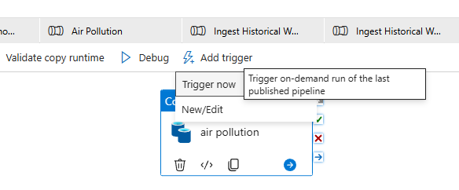
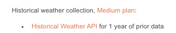
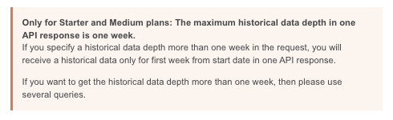
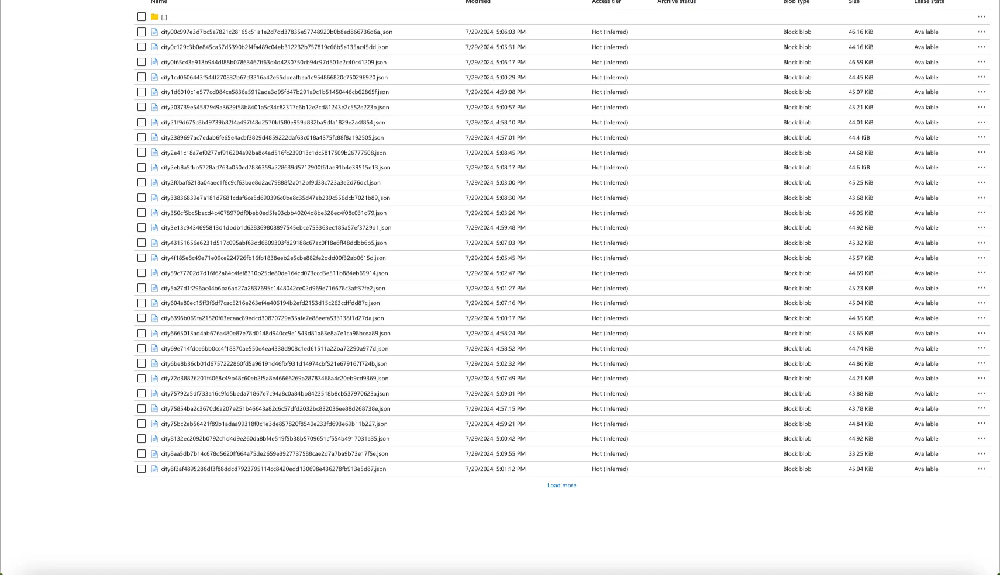

# HW1: Azure Account Setup & API Connection

### Part 1: Sign Up for an Azure Student Account

**Objective**: Set up an Azure account and the foundational resources necessary for the subsequent homework assignments. This involves creating a Resource Group, Storage Account, Blob Storage container, Data Factory, and connecting a Git repository.

**Tools**: Azure Portal

**Create an Azure Student Account**:

- Visit the [Azure Student Free Account website](https://azure.microsoft.com/en-us/free/students) and click on “Activate your student benefits.”
- Follow the prompts to sign up for a new Azure student account. You might need to verify your student status through your educational institution’s email. Note that Azure offers *$100* in credits for 12 months and a range of free services.
- Make sure to select the **Azure Student Subscription** (and not the BU IS&T subscription)

### 2. Set Up a Resource Group
💡 ***What is a Resource Group?***  
[**Resource groups**](https://learn.microsoft.com/en-us/azure/cloud-adoption-framework/ready/azure-setup-guide/organize-resources) are logical containers where you can deploy and manage Azure resources like virtual machines, web apps, databases, and storage accounts. Similar to the *folder system* inside your laptop/personal computer, it helps organize related Azure resources  that work together to support a specific application or service.

- **Create a Resource Group within your Subscription**




***Please make sure that the region is set to East US 2 otherwise you will run into cost issues…***

### 3. Create a Data Lake Storage Gen 2 Account

<aside>
💡 ***What is a Data Lake Storage Gen 2 Account?***  
[**Data Lake Storage Gen 2](https://learn.microsoft.com/en-us/azure/storage/blobs/data-lake-storage-introduction)** is a set of capabilities dedicated to big data analytics built on top of [Azure Blob Storage](https://learn.microsoft.com/en-us/azure/storage/blobs/storage-blobs-overview). It provides *file system semantics, file-level security, and scale on top of* Azure Blob Storage’s *low-cost, tiered storage, with high availability/disaster recovery capabilities.*
A good analogy is to think of Blob Storage as a **pile of books**, whereas Data Lake Storage Gen 2 is putting that pile into a **library**, giving order/hierarchy to the unstructured pile of data files.
~*For the curious, Gen1 is a standalone service whereas Gen2 is unified with Blob Storage~*

</aside>

**Create a Storage Account within your Resource Group**

- **Region**: ‘(US) East US 2’.
- **Performance**: Standard (for general-purpose storage).
- **Redundancy**: Locally redundant storage (LRS) is sufficient for this homework.

<aside>
💡

***Data Redundancy*
[Data redundancy](https://learn.microsoft.com/en-us/azure/storage/common/storage-redundancy)** is the practice of storing multiple copies of the same data in different locations or systems. While having multiple copies of data might seem inefficient, it ensures that the data remains available and reliable across different regions and in the case of database failure.

Designing Data-Intensive Applications by Martin Kleppmann describes the reasoning behind data redundancy well:

*"Replication is used to keep a copy of the same data on multiple machines, which can serve several purposes: to increase **availability** (allowing the system to continue working even if some parts of it are down), to increase **read throughput** (by load balancing reads across replicas), and to **reduce latency** (by keeping data geographically close to users)…”*

In the context of our Azure use case,  we will be using the cheapest redundancy, **LRS, which** maintains three synchronous copies within a single data center. It does not replicate across other data centers/regions, and is the most at-risk in terms of data unavailability events.

</aside>

- **Advanced**: Ensure you enable "Hierarchical namespace". This enables Data Lake Storage Gen 2 features on top of your Blob Storage.


### 4. Create a Blob Storage Container

**Create a Blob Container within your Storage Account**

- **Public Access Level**: Private (no anonymous access).

<aside>
💡 This can be done by navigating to the storage browser within the Azure Blob Storage sidebar menu, and creating a container. 
*If hierarchal namespace (Data Lake V2 Feature) wasn’t enabled, you would have noticed the ability to create a flat container, but not a container stored within a container (nested containers).*


</aside>

### 5. Create an Azure Data Factory

**Create an Azure Data Factory within your Resource Group**

- **Region**: ‘(US) East US 2’.


<aside>
💡 ***What is a Azure Data Factory (ADF)?***
[ADF](https://learn.microsoft.com/en-us/azure/data-factory/introduction) is a cloud-based data integration service that is designed to orchestrate and automate data movement and transformation across various data sources and destinations. It is cost effective (pay as you use) and scalable for enterprise data needs.

</aside>

### 6. (Optional) Create and Connect a Git Repository

<aside>
💡

Github can be connected with your ADF environment to automate the build, test, and deployment process of pipelines. For homework purposes, this step is not necessary, but is an option you can consider for your projects.

</aside>

**Connect Azure Data Factory to [GitHub](https://learn.microsoft.com/en-us/azure/data-factory/connector-github?tabs=data-factory)**:

- You need to first launch the ADF


### 7. Sign Up for OpenWeatherMap Free Access

<aside>
💡 We will be pulling from the **OpenWeatherMap** API for both stream data and batch processed data. This API provides access to current weather data, forecasts, and historical weather data for any location worldwide.

</aside>

1. **Create an OpenWeatherMap Account**:
    - Visit the [OpenWeatherMap for Education website](https://openweathermap.org/our-initiatives) and follow the steps to sign up for an account.
    - Provide the necessary information to verify your student status and gain free access to their services.
    
    
    

### 8. Grant Instructors Access to Resource Group

In order for your assignments to be graded, the instructors require access to view your resource group containing your assignment work. Below is a series of screenshots detailing how to properly grant instructors access.

<aside>
💡


Within the resource group menu, there is a submenu called Access Control, where you can add/remove role assignments to the overall resource. 


Amongst the roles you can assign, we want to assign instructors “Contributor” over the entire resource group. This allows instructors to view any resource created within the resource group.


We then want to assign access to the 3 instructors: **gjiang@bu.edu, joshyip@bu.edu, seferlis@bu.edu**


Ensure that the assignment type is both “Active” and “Permanent” 

</aside>

### Part 2: Connecting to the API

**Objective**: Ingest weekly historical weather and air pollution data from the OpenWeather APIs into Azure Data Lake Storage using Azure Data Factory. We want at least a year’s worth of this weekly data, and will have to model our pipelines to account for the API call restrictions. This involves using the API key within ADF, ADF linked services, building & running pipelines, monitoring the data ingestion process, and pushing configurations to a GitHub repository. 

**Tools**: Azure Data Factory, OpenWeather Historical Weather API, OpenWeather Air Pollution API, Azure Key Vault

*Before we start, we need to first learn about Data Lakehouse, as well as the Medallion Lakehouse Architecture.*

<aside>
💡 [A Data Lakehouse](https://learn.microsoft.com/en-us/azure/databricks/lakehouse/) is a data management system that combines the best features of data lakes (scalability, flexibility) and data warehouses (structure, performance) all under a single architecture.

</aside>

<aside>
💡 [Medallion Lakehouse Architecture](https://learn.microsoft.com/en-us/azure/databricks/lakehouse/medallion) is a data management and analytics architecture pattern used in modern Data Lakehouse environments. This architecture is designed to organize and manage data efficiently as it flows through different stages, typically referred to as **Bronze**, **Silver**, and **Gold** layers. Refer to the documentation on the specific differences of the layers.

</aside>

<aside>
💡 **API Call Restrictions**
The [OpenWeather API](https://openweathermap.org/current) has call restrictions for the max amount of data you can retrieve per API call. This amounts to a week’s worth of hourly data for both the historical weather and air pollution data. We will have to model our pipeline to loop through a series of *weekly API calls* in order to collect a year’s worth of weather data in spite of the restrictions.
****

</aside>

<aside>
💡 **Security: Our Homework Purposes**
Originally, the various assignments utilized the Azure Key Vault service to securely contain API keys. Having unencrypted API keys within pipelines/code is a major security issue, but for our homework purposes we want to avoid complicating processes. Identity management and permission sets will be discussed in class, but not required for the homework.
****

</aside>

### 1. Set Up Linked Services

We will be creating ADF linked services for all resources we will be using. 

<aside>
💡

***What are Linked Services?***

[Linked services](https://learn.microsoft.com/en-us/azure/data-factory/concepts-linked-services?tabs=data-factory) refer to connections to external resources/services, enabling the platform to interact with those sources. The true power of linked services comes from their *reusability in different pipelines/dataflows.*

For example, if you are copying data from an Azure SQL Database to an Azure Blob Storage, linked services must be first defined for the SQL Database and for the Azure Blob Storage. After creating these services, if you need to reference those same datasets for different transformations/dataflows, you can just reference the created linked services instead of making the connections from scratch again.

</aside>

<aside>
💡

***What is Anonymous Authentication?***

[Anonymous authentication](https://learn.microsoft.com/en-us/iis/configuration/system.webserver/security/authentication/anonymousauthentication) allows users to access resources or applications without providing any identity verification (e.g., username or password). It is typically used for public-facing applications or websites where user identity is not necessary for basic access. 

</aside>

<aside>
💡 There are **two ways** to create linked services in Azure Data Factory. First way is recommended.

1. After creating a new Activity in the pipeline orchestration menu, you can click “+New” in the Linked Service menu under “Source” and “Sink”.
2. Go to Manage → Linked Services and create the necessary services for your pipeline, which you will then reference in the appropriate activity’s dataset connection. 
</aside>

1. **Create Linked Service for OpenWeather APIs (Weather Data):**
    
    [How to make an API call to the Historical Weather API](https://openweathermap.org/history)
    
    <aside>
    💡 [**REST vs HTTP**](https://learn.microsoft.com/en-us/azure/data-factory/connector-http?tabs=data-factory)
    
    You have two choices when creating linked services connecting to the OpenWeather API:
    
    1. [REST](https://learn.microsoft.com/en-us/azure/data-factory/connector-rest?tabs=data-factory) connector specifically support copying data from RESTful APIs, following the REST architectural principles. 
    2. [HTTP](https://learn.microsoft.com/en-us/azure/data-factory/connector-http?tabs=data-factory) connector is generic to retrieve data from any HTTP endpoint, e.g. to download file. It’s requests are unstructured compared to REST, and requires specific mapping to adhere to API requests.
    
    Before REST connector becomes available for an API, you may use the HTTP connector to copy data from RESTful APIs, which is supported but less functional comparing to REST connector. For the purpose of the homework, we will be using the **HTTP** connector. The only difference being that with a REST dataset, you wouldn’t initially specify the datatype whereas with HTTP you would (JSON).
    
    </aside>
    
    Create an HTTP linked service.
    
    **Base URL**: Enter the base URL for the OpenWeather Historical Weather API (`https://history.openweathermap.org/`).
    
2. **Create Linked Service for OpenWeather APIs (Air Pollution Data)**:
    
    [https://openweathermap.org/api/air-pollution](https://openweathermap.org/api/air-pollution)
    
    - **Hint:**
        - **Base URL**: Enter the base URL for the OpenWeather Historical Air Pollution API (`http://api.openweathermap.org/`). Within our upcoming pipeline, we will be simulating the concatenation of API parameters onto this pipeline (example of full call below):
            
            
            
3. **Create Linked Service for Azure Data Lake Storage.**
    
    
    
    
    

### 4. Create Pipelines for Data Ingestion

Now, we have to create pipelines to ingest the historical data into our ADLS storage

<aside>
💡 Refer to this for the Historical Weather Data API calls: [OpenWeather Historical Weather API](https://openweathermap.org/history#list)

</aside>

**Task:** The pipeline must ingest the following historical weather & air pollution data:

Location: Boston *(this can be done by identifying the longitude and latitude coordinates of the Boston area)*

Frequency: Hourly

Time Frame: Data from approximately **one year ago to yesterday**, ensuring coverage for roughly 11 months.

**Best Practice:** For better organization and maintenance, create **two separate pipelines** for weather data and air pollution data ingestion.

- **Create a Pipeline for Historical Weather Data**:
    
    <aside>
    💡
    
    **Pipeline Logic:**
    
    Make multiple API calls in **Copy Data** activities within a ForEach loop, where the source collects data from the API and sinks it into local storage.
    
    </aside>
    
    1. The API key will be passed to the API dataset parameter “appid” by directly pasting the API into the parameter space
    2. Create the ‘**ForEach’** activity to account for the OpenWeatherAPI restrictions (one API call is worth one week of data)
    
    <aside>
    ⚠️ **HINT:** FOR HISTORICAL WEATHER DATA, WE NEED TO USE SEVERAL QUERIES!! This is due to the OpenWeather API restricting historical information returned by API calls to one week per call. Ensure you include the necessary parameters required for the web API.
    
    
    
    
    
    </aside>
    
    <aside>
    💡 To make **multiple API calls** within ADF, we need to utilize the [**ForEach**](https://learn.microsoft.com/en-us/azure/data-factory/control-flow-for-each-activity) activity flow, which will repeat the **‘Copy’** activity for the specified dates.
    
    - [Documentation Link on setting up ForEach Activity](https://learn.microsoft.com/en-us/azure/data-factory/control-flow-for-each-activity)
    This activity is used to iterate over a collection and executes specified activities in a loop. The loop implementation of this activity is similar to Foreach looping structure in programming languages. Ensure the Sequential option is checked if you want the iterations to run one after another. If you want them to run in parallel, leave it unchecked.
        
        
        
    
    Note: the **Items** property (within the ForEach loop) is used in Azure Data Factory or Azure Synapse *Pipelines* for iterating over a collection of values. It defines the list of values or objects that a loop will iterate over. For the homework, we want to iterate over specifically the *dateRanges* parameter of the pipeline.
    
    <aside>
    💡
    
    ***Should I use parameter or variable?***
    
    The main [difference](https://learn.microsoft.com/en-us/azure/data-factory/concepts-parameters-variables) between the two is that pipeline parameters cannot be modified during a pipeline run, whereas pipeline variables are values that can be set and modified during a pipeline run via “set variable activity”. **For the purpose of this assignment,** you will need a variable/parameter to define the range in which the ForEach loop should run. 
    
    
    
    You can access Parameters of a pipeline by simply clicking an empty area in the pipeline window, and the menu would appear.
    
    </aside>
    
    </aside>
    
    <aside>
    💡
    
    **Working around the Historical Weather API restrictions**
    Every time the Copy Data activity within the ForEach loop is ran, it makes a GET request to the OpenWeather API. We want to collect at least a week’s worth of data per API call, and get the past year’s (52 weeks) historical weather data starting from today. To do this, we need to not only set dynamic expressions for the “start” and “end” date parameters (which the API requires) to collect the right range of information, but also match the formatting to the API’s UNIX time formatting. Here are some useful functions from the ADF expression language that you might find yourself using:
    
    - *addDays(startDate, daysToAdd, format?) -* adds (or subtracts) a specified number of days to a given date or timestamp. You can use this function to dynamically set date ranges
    - *utcNow() -* returns the current date and time in UTC format. You will need to convert this into the OpenWeather API time format within your expression.
    - *item()* - returns the current value in a loop within a ForEach activity in Azure Data Factory.
    - *ticks()* - converts a date into the number of "ticks" since specified epoch time in .NET ticks (1 tick = 100 nanoseconds). You will need this function to format the UNIX expression into the OpenWeather format, which is *ticks now - ticks since '1970-01-01T00:00:00Z’* (UNIX Epoch time). Then you would still need to convert these *ticks* into UTC format (divide by 10000000)
    
    ```jsx
    *@div(sub(ticks(addDays(utcNow(), mul(add(item(),1), -7))), ticks('1970-01-01T00:00:00Z')), 10000000)*
    ```
    
    </aside>
    
    1. **‘Copy’** activity will run the API call within the ‘ForEach Loop’
    - **Source - HTTP or REST - Relative URL example (for the HTTP dataset connection)**
        - **Relative URL** refers to the portion of the URL that is relative to the base URL (or endpoint) of the API server.
        
        ```
        data/2.5/history/city?lat=@{dataset().lat}&lon=@{dataset().lon}&type=@{dataset().dataType}&start=@{dataset().start}&end=@{dataset().end}&appid=@{dataset().appid}
        ```
        
        <aside>
        💡 Notice the above code is similar to the API call example here:
        
        
        
        The `@{dataset()}` function in Azure Data Factory (ADF) is used within a dataset to access parameters defined in that dataset. This allows you to create dynamic datasets that can change based on the input parameters passed to them from the pipeline. 
        
        - `@{dataset().lat}`: Accesses the `lat` parameter value passed to the dataset.
        - `@{dataset().lon}`: Accesses the `lon` parameter value passed to the dataset.
        - `@{dataset().dataType}`: Accesses the `dataType` parameter value passed to the dataset.
        - and so on for the rest of the parameters…
        </aside>
        
    - **‘Sink’** will be your ADLS (Make sure you create a directory called ‘Bronze’, based on the Medallion Lakehouse Structure)
- **Create a Pipeline for Air Pollution Data:**
    
    Refer to this for the Historical Air Pollution Data: [OpenWeather Air Pollution API](https://openweathermap.org/api/air-pollution)
    
    <aside>
    💡
    
    The air pollution API connection has considerably less restrictions in terms of API calls, so the pipeline will be more straightforward compared with the historical weather data pipeline.
    
    
    
    </aside>
    

### 4. Trigger the Pipelines Now

1. **MAKE SURE EVERYTHING IS CORRECT UP TO THIS POINT BEFORE MOVING ON!**
2. **Trigger the Pipelines. PLEASE DO NOT USE DEBUG MODE! Instead, just trigger the pipeline:**


1. **Monitor the Pipeline Run.**

### 5. Monitor Costs

<aside>
💡 Monitoring costs is very important in this course, as cost issues could spiral into thousands of dollars of misused compute. We recommend subscribing your BU email to the cost alerts and being vigilant that your costs stay within budget.

You can find your cost under **Cost Analysis** in the Cost Management tab. If you are using an RG using Professor’s subscription, you can monitor your specific RG’s costs under Root Management Group →  Professor’s Subscription → Your Specific RG


</aside>

1. **Check Cost Management**:
    - After completing the homework, navigate to the “Cost Management + Billing” section in your Azure Portal.
    - Go to “Cost Management” under your subscription to view your spending details.
2. **Take a Screenshot**:
    - Take a screenshot showing how much you spent during the completion of this homework.

### 6. (Optional) Push Configurations to GitHub

1. **Commit and Push to GitHub**:
    - In your Azure Data Factory, navigate to the “Manage” tab and then to “Git Configuration.”
    - Ensure your changes are committed.
    - Push the committed changes to the configured GitHub repository.
2. **Take a Screenshot**:
    - Take a screenshot of your GitHub repository showing the committed and pushed changes related to this homework.

### Deliverables:

- details of specific elements instructors are looking for to be outlined on Gradescope, but below is general idea of what we are looking for




For historical weather, you can have several files, or one large file depending on if you flattened the hierarchy or not. Air pollution will have one large file.

---