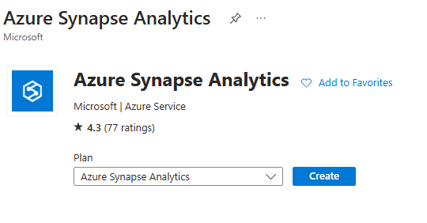
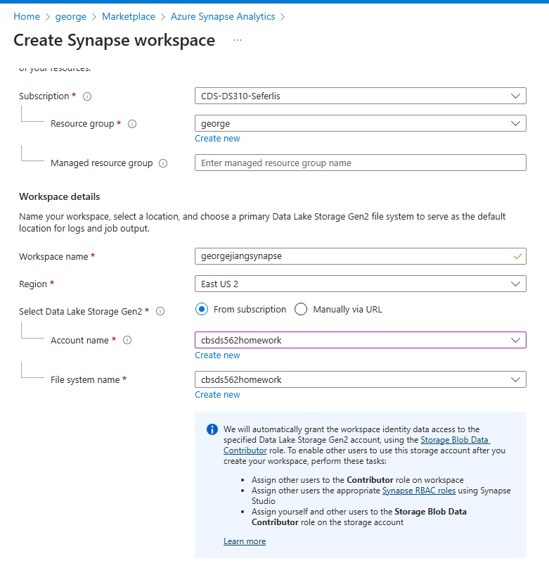
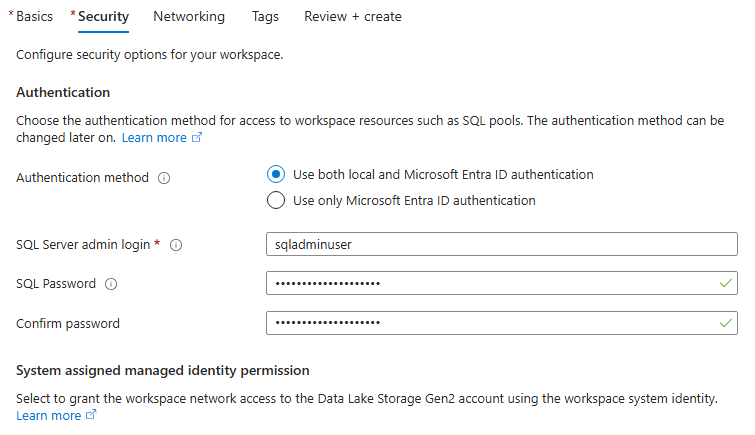
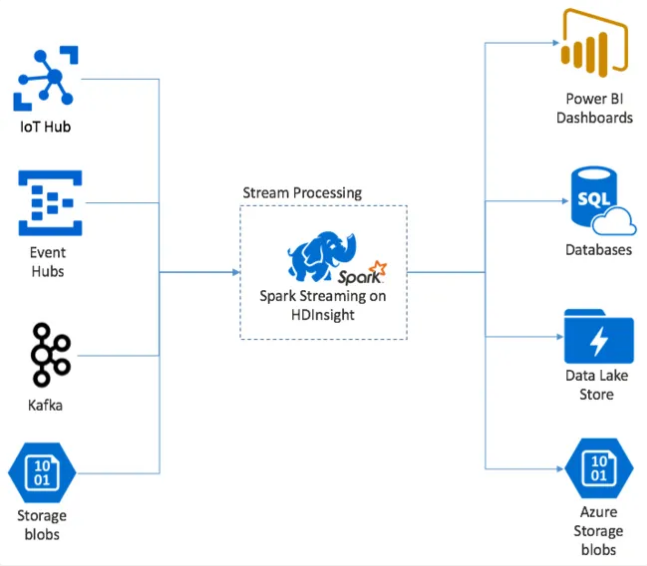
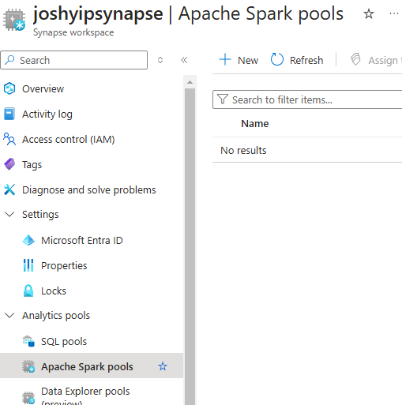
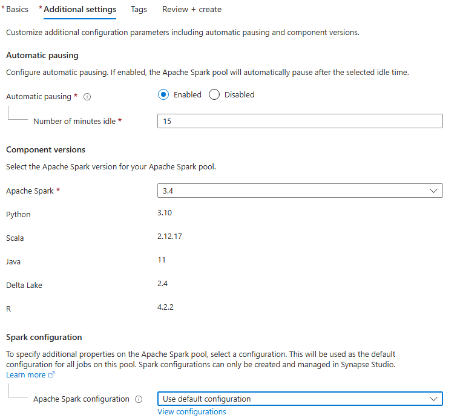

# HW2: Azure Synapse & EDA Notebook

**Objective:**

Using the notebook environment in Synapse Analytics Serverless Spark Cluster, connect to storage and perform an exploratory data analysis (EDA) on the historical weather and air pollution data processed in Homework 1. This involves directly connecting to your respective storage account, visualizing the data, identifying patterns, and preparing insights for further analysis. Students have full freedom to run any EDA code to discover the data. However, the criteria instructors inspect is: 
- check the distribution of data
- run a correlation matrix to compare all the variables including between the two datasets
- perform time series analysis. 

The report must have detailed insights into the dataset, and students should have an idea of how this dataset can be processed and be ready for the users.


>***What is the purpose of EDA?***
[EDA](https://learn.microsoft.com/en-us/ai/playbook/capabilities/experimentation/exploratory-data-analysis) is conducted to gain a comprehensive understanding of data before diving into more complex analyses or machine learning model development. It serves several key functions:
>1. **Data Understanding**: EDA helps in understanding the data's distribution, identifying outliers, and assessing completeness. This step is crucial to ensure that the data is relevant and sufficient for solving the specific business problem at hand.
>2. **Problem Identification**: By exploring the data through statistical methods and visualizations, EDA allows you to identify potential issues, such as missing values, errors, or biases, that could impact the analysis or model performance.
>3. **Hypothesis** Generation: EDA informs the generation of hypotheses and experimentation strategies. It provides insights into which data transformations, features, or models might be most effective for a given problem.
>4. **Data Suitability**: It assesses whether the data is suitable for further analysis or machine learning tasks, and may also influence the choice of algorithms and preprocessing techniques.
>5. **Preparation for Further Analysis**: Finally, EDA is often a preparatory step that helps in deciding the next steps in data preparation and modeling, ensuring that subsequent analyses are built on a solid understanding of the data.

### Steps:

#### 1. Set Up Synapse Analytics Workspace
>💡 ***What is Azure Synapse Analytics?*
[Azure Synapse Analytics](https://azure.microsoft.com/en-us/products/synapse-analytics#:~:text=Azure%20Synapse%20Analytics%20is%20an,log%20and%20time%20series%20analytics)** is an integrated analytics service that combines big data and data warehousing. It allows you to query data using either serverless or provisioned resources, providing a unified experience to ingest, prepare, manage, and serve data for immediate business intelligence and machine learning needs. Synapse enables efficient data processing across various data types, including structured, unstructured, and streaming data, making it ideal for complex analytical workloads.
**For this homework specifically**, you will be utilizing Synapse's spark cluster to run python noteboooks on the cloud.
>




Make sure to select the data lake (storage account) you previously created that hosts your ingested batch data (from the first homework).


Set the username to **sqladminuser** and password to **sqladminpassword123#** for now. We will utilize the SQL pool in future homeworks when preparing external tables for powerBI access. 
Ignore the networking tab for now and **review and create** the synapse workspace.


#### 2. Set Up a Apache Spark Cluster
>💡 ***What is Apache Spark?*
[Apache Spark](https://learn.microsoft.com/en-us/azure/databricks/spark/)** is an open-source, distributed processing system designed for big data workloads. It provides *in-memory computing*, which speeds up data processing tasks, etc. It is the underlying distributed data processing engine used by *Databricks*, which is a cloud-based platform that provides a collaborative environment for data engineering, data science, and machine learning. When you deploy a compute cluster or SQL warehouse on Azure Synapse or Databricks, Apache Spark is configured and deployed to virtual machines. You don’t need to configure or initialize a [Spark context or Spark session](https://www.notion.so/HW7-Batch-Processing-c41cbdf25444472aa84f9680514868df?pvs=21), as these are managed for you by Azure. It uses lazy evaluation to process transformations and actions defined with DataFrames.
>- **DataFrames** are the primary objects in Apache Spark. A DataFrame is a dataset organized into named columns. You can think of a DataFrame like a spreadsheet or a SQL table, a two-dimensional labeled data structure of a series of records and columns of different types. They also provide a rich set of functions that allow you to perform common data manipulation and analysis tasks efficiently.
>- Transformations: In Spark you express processing logic as transformations, which are instructions for loading and manipulating data using DataFrames. Common transformations include reading data, joins, aggregations, and type casting.
>- **Lazy Evaluation**: Spark optimizes data processing by identifying the most efficient physical plan to evaluate logic specified by transformations. However, Spark does not act on transformations until actions are called. Rather than evaluating each transformation in the exact order specified, Spark *waits until an action triggers computation on all transformations*. Spark handles their execution in a deferred manner, rather than immediately executing them when they are defined.
>


Navigate to the Synapse Workspace Analytic Pools dropdown menu.


Ensure you follow the exact configuration settings shown in the screenshot to avoid cost overruns. For the above, we are ensuring that we use a low cost node size, but enabling Autoscaling in case we need more nodes of compute for our EDA runs.

In cases where you run Spark jobs overnight, automatic pausing ensures that once the job is complete, after a specified amount of time without any further compute requests the cluster will pause.
Click **Review and create** , then click **create**.


#### 3. Create a Synapse Notebook Environment
Now that we have created a spark cluster, we have the compute neccessary to run Python Notebooks within synapse. Let's create a notebook within Synapse. **Open Synapse Workspace and navigate to the following menu:**


>💡 ***What is PySpark?*   
>[PySpark](https://learn.microsoft.com/en-us/azure/databricks/pyspark/)** is the Python API for Apache Spark, an open-source distributed computing system that enables large-scale data processing. PySpark allows you to use Python to interact with Spark’s capabilities, such as in-memory data processing, distributed machine learning, and graph processing. It's commonly used for big data analytics, enabling you to process large datasets efficiently across a cluster of machines. PySpark integrates seamlessly with other big data tools, including Hadoop, and is widely used in data engineering, data science, and machine learning projects

Now we need to setup our Python script to access the data stored within our data lake.

1. **Set up Access to Azure Data Lake Storage (ADLS):**
    - In your Databricks notebook, configure access to your ADLS account using the storage account name and key.
        
        ```python
        # Set up the configuration for accessing the storage account
        storage_account_name = ""
        storage_account_key = ""

        spark.conf.set(
            "fs.azure.account.key." + storage_account_name + ".dfs.core.windows.net",
            storage_account_key
        )

        ```
2. **Access the ADLS Container:**

- Use “abfss” (instead of “wasbs” which is for Databricks) to directly access the ADLS container.
- Can just reference a folder/access point containing multiple json files, and Azure is able to parse them together (for historical weather specifically).
    
    ```python
    # Read data directly from ADLS Gen2
    container_name = ""
    air_pollution_folder_path = ""  # Folder, not a single file
    historical_weather_folder_path = ""

    # Read all JSON files in the folder
    air_pollution_df = spark.read.json(f"abfss://{container_name}@{storage_account_name}.dfs.core.windows.net/{air_pollution_folder_path}")
    historical_weather_df = spark.read.json(f"abfss://{container_name}@{storage_account_name}.dfs.core.windows.net/{historical_weather_folder_path}")
    # Show the DataFrame
    ```
  
3. **Preview data frame contents.**
 ```python
    historical_weather_df.head()

    air_pollution_df.head()
  ```
  
4. **Display the schema and summary statistics.**
    
    ```python
    # Display schema for weather data
    #ex: ____.printSchema()
    # Display schema for air pollution data
    
    # Convert Spark DataFrame to Pandas DataFrame for summary statistics (.toPandas())
    
    # Summary statistics for weather data
    
    # Summary statistics for air pollution data
    ```


5. **Use built-in visualization tools in Synapse notebooks or use external libraries like matplotlib, seaborn, or plotly.**
    - Minimum of 4 different types of visualizations. Examples: Distribution of temperature (with weather data), Distribution of AQI (air pollution data), Scatter plot of temperature vs humidity (weather data), Scatter plot of AQI vs CO (air pollution data).

6. **Terminate the Cluster**
    Stop your session once completed with all the tasks.
### Deliverables:

**EDA Report:** 
    **Write a one-page report on the EDA results and insights for the weather and air pollution data.**
    - Discuss patterns, anomalies, and insights you observed during the EDA.
    - Include visualizations to support your findings.
    - ✅ Font Size: 12pt,Font Type: Arial, Line Spacing: 1.5
    - Submission Format: PDF
    - Notebook: Exported HTML file of your Databricks notebook.

We want to be able to view your visualizations without having to spin up your compute clusters everytime, so please attach all your graphs/charts created in the EDA report.
