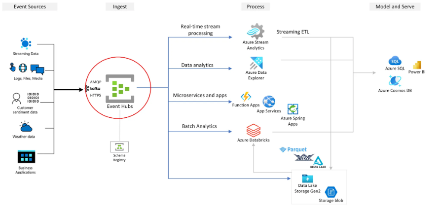
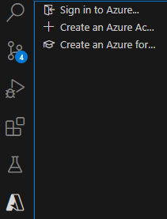
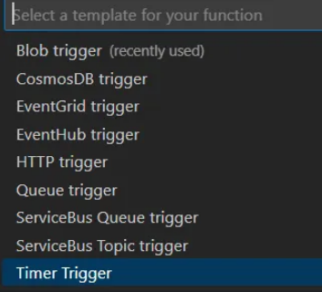
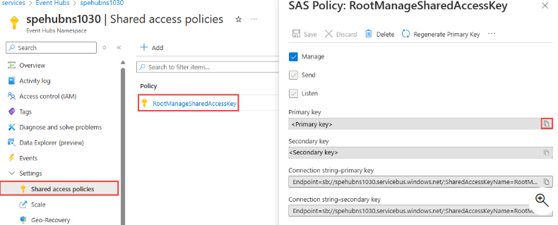
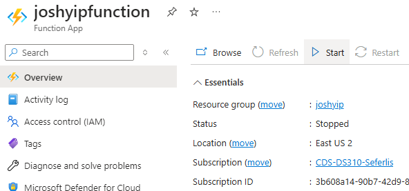
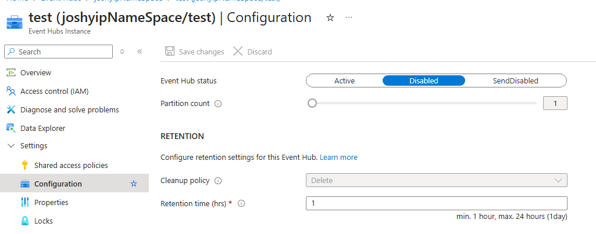

# HW3: Event Hubs and Azure Functions

**Objective:**

Ingest real-time weather and air pollution data from the OpenWeather APIs into Azure Event Hubs using Azure Functions. This involves setting up an Event Hubs namespace and event hub, creating an Azure Function to fetch real-time data and send it to Event Hubs, and verifying the data ingestion process. 
What instructors are looking for:
- correctly setup Event Hubs namespace and instance
- properly connected Azure Functions App w/ Event Hubs
- Event Hubs was able to process events from the Open Weather API
    - we expect to see a screenshot of the activity on Gradescope

Before you write any code, make sure **VScode** is up to date!

### Steps:

#### 1. Set Up Event Hubs
>***What is Azure Event Hubs?***
Azure Event Hubs, **similar** to Apache Kafka, is a fully managed, real-time data ingestion service designed to handle large volumes of data from various sources, such as applications, devices, or services, enabling you to stream data and process it in real-time or store it for later analysis.  We will be using Event Hubs to ingest real-time weather data from the Open Weather API. This setup will allow us to process and analyze the data continuously, enabling us to derive insights, trigger alerts, or visualize trends in real-time.  the choice of algorithms and preprocessing techniques.



>***How are Apache Kafka and Event Hubs related?***
Event Hubs and Apache Kafka are extremely interchangeable (since Event Hubs was built to support Kafka functionalities). They're both partitioned logs (log data that is divided or "partitioned" into separate segments based on certain criteria) built for streaming data, whereby the client controls which part of the retained log it wants to read. While Apache Kafka is software you typically need to install and operate, Event Hubs is a fully managed, cloud-native service with several functionalities applied on top of Kafka architecture making it suitable for enterprise use.


>💡 ***If you get stuck...***
[Event hubs Features](https://learn.microsoft.com/en-us/azure/event-hubs/event-hubs-features)
[Creating an Event Hubs](https://learn.microsoft.com/en-us/azure/event-hubs/event-hubs-create)
1. **Create an Event Hubs Namespace**:
    - **Subscription**: Select your subscription.
    - **Resource Group**: Select the resource group created in HW0.
    - **Namespace Name**: Enter a unique name for your Event Hubs namespace (e.g., `ds598(name)namespace`).
    - **Location**: Choose the same region as your resource group.
    - **Pricing Tier**: Select the appropriate pricing tier (Basic).
2. **Create an Event Hub Instance**:
    - Once the namespace is created, navigate to it.
    - Under "Entities," click on "Event Hubs" and then "+ Event Hub."
    - **Partition Count**: Leave the default value (1).  All events are written and read sequentially from that single partition.
    >***What is Data Partitioning?***
    Data Partitioning refers to the strategy of dividing a large dataset into smaller, more manageable pieces, or "partitions," to improve performance, scalability, and availability of applications. These partitions can be designed based on several factors, such as the nature of the data, access patterns, and the specific requirements of the application. 

    >The **Partition Count** in Azure Event Hubs refers to the number of partitions that an Event Hub is divided into. Partitions are essentially parallel data streams within an Event Hub, and they allow for the distribution of data ingestion and processing loads across multiple consumers to allow for more effective processing.

3. **Message Retention:** Leave the default value (1 hour).
    >**Message Retention** in Azure Event Hubs refers to the amount of time that messages (events) are stored in the Event Hub after they are received. During this retention period, consumers can read the messages at any time. Once the retention period expires, the messages are automatically deleted from the Event Hub. 

4. Ensure **Event Hubs Capture** is turned off for now.
    >**Event Hubs Capture** is used to archive data beyond the Event Hub retention period, you can enable the "Event Hubs Capture" feature which automatically copies data to a storage account like Azure Blob Storage.
    


#### 2. Set Up Azure Functions
>💡 ***What are Azure Functions?***
[Azure Functions](https://learn.microsoft.com/en-us/azure/azure-functions/) are serverless compute services provided by Microsoft Azure that allow you to run small pieces of code (functions) in the cloud without the need to manage the underlying infrastructure. It particularly useful for:
**Automating Tasks**: Azure Functions can automate repetitive tasks, such as sending notifications, processing files, or handling workflows.
**Real-Time Data Processing**: Functions can process real-time data streams, such as analyzing incoming data from IoT devices or processing logs as they are generated.
**Integrating Systems**: Azure Functions can act as a bridge between different services and systems, allowing you to integrate Azure services or third-party applications by running code when data is received or sent.
**Creating APIs**: Azure Functions can be used to build serverless APIs, where each function serves as an endpoint that processes requests and returns responses.
[...etc.](https://learn.microsoft.com/en-us/azure/azure-functions/functions-overview?pivots=programming-language-csharp#scenarios)
1. **Create an Azure Function App**:
    - In the Azure Portal, create a new Function App.
    - When prompted to select a hosting option, select the “Consumption” Plan:
        - This plan allows you to pay for compute resources only when your functions are running **(pay-as-you-go).**
    - Fill in the necessary details such as subscription, resource group, and region. Use the same resource group as your Event Hub.
    - Choose a unique name for your Function App.
    - Optional if you enabled Github: Enable CI/CD via Github Actions 
    - Select the runtime stack as "Python" and the version as "3.9" (or your preferred version).
    - **Configure Storage**:
        - Select an existing storage account. If you do not have one, create a new one.
        - Optionally, add an Azure Files connection.
        - Under Diagnostic Settings, select "Don’t configure diagnostic settings now" to save on costs.
            >💡 ***Diagnostic settings*** in Azure are used to collect logs, metrics, and other data for monitoring and troubleshooting purposes. By choosing not to configure diagnostic settings at that moment, we are essentially deciding to skip the setup of monitoring and logging configurations, which can be done later as needed.
    - **Configure Monitoring**:
        - Under Monitoring, select "No" for Enable **Application Insights** to save on costs.
            > ***What is Azure Event Hub Monitoring?***
            [Azure Monitor](https://learn.microsoft.com/en-us/azure/event-hubs/monitor-event-hubs?tabs=AzureDiagnostics%2CAzureDiagnosticsforRuntimeAudit%2CAzureDiagnosticsforAppMetrics)  provides real-time metrics that allow you to monitor the performance of your Event Hubs. Metrics such as incoming requests, outgoing messages, and errors can be tracked to ensure your system is running smoothly.  The cost of monitoring comes from several factors:
                - Data Collection: Gathering metrics and logs from your Event Hubs incurs costs based on the volume of data collected.
                - Data Retention: Storing this data for analysis or compliance purposes also adds to the cost, particularly if you retain data for long periods.
                - Analysis and Queries: Running custom queries and creating dashboards to visualize and analyze this data requires compute resources, which are billed accordingly.

            Since we will be dealing with relatively low traffic and small data volume, monitoring is not necessary for homework purposes.

    - **Review + Create**:
        - Click "Review + create," then "Create".

### 3. Using Azure Functions in Visual Studio Code to Deploy Code
>💡 We will be using **Visual Studio Code** as our primary IDE. You can write, debug, and deploy your functions directly from the editor, with integrated tools and extensions that make it easy to connect to Azure Event Hubs. Furthermore, VS Code allows you to develop and test Azure Functions locally before deploying them to the cloud. This ensures that your code works correctly with Azure Event Hubs in a controlled environment before it goes live.

1. **Set Up Local Development Environment**:
    - Install [Visual Studio Code](https://code.visualstudio.com/) and the [Azure Functions extension](https://marketplace.visualstudio.com/items?itemName=ms-azuretools.vscode-azurefunctions).
    

2. **Login to your Azure Account**
    

3. **Create a Functions App**

- [Make sure you configure your project to trigger every hour](https://www.geeksforgeeks.org/creating-azure-timer-trigger-function-using-vscode/#)

    - `0 0 * * * *` (CRON expression for the timer trigger) which will show up in a created Python Decorator Function in your template *.py* file
        
        >💡 ***What are CRON(command on run) expressions?***
        [Cron expressions](https://learn.microsoft.com/en-us/azure/azure-functions/functions-bindings-timer?tabs=python-v2%2Cisolated-process%2Cnodejs-v4&pivots=programming-language-csharp#ncrontab-expressions) are strings used to define the schedule for running tasks at specific times or intervals. In the context of Azure Functions, CRON expressions allow you to schedule when a function should be executed based on a precise time pattern. For our purposes, we will be using a variation of CRON called NCRONTAB expression, which uses six fields for increased precision: 
            **{second} {minute} {hour} {day} {month} {day-of-week}**
            *Where `0 0 * * * *` translates to: *task running at 0th second on the 0th minute of every hour, day, month, and day of the week.**
            The "Timer Trigger" will add this following code block to your code:
             ```@app.timer_trigger(schedule="0 0 * * * *", arg_name="mytimer", run_on_startup=True, use_monitor=True) ```
1. **Write the Python Script & requirements.txt**:
    - In the `function_app.py`, replace the default code with the Python script below:
        - Ensure the weather and pollution data are both retrieved using **separate API calls** and combined into one JSON data once collected.
        
    - Fill in the following code:
        
        ```python
        import logging
        import requests
        import json
        from azure.eventhub import EventHubProducerClient, EventData
        from azure.identity import DefaultAzureCredential
        #from azure.keyvault.secrets import SecretClient 
        #--this was used in the past to securely store key vault secrets
        import datetime
        import os
        import pytz
        import azure.functions as func
        
        app = func.FunctionApp()
        
        # Configure logging
        logging.basicConfig(level=logging.INFO)


        # Define your Event Hub connection details
        connection_str = os.getenv("EVENT_HUB_CONNECTION_STRING")

        eventhub_name = 

        # Define your OpenWeather API key and endpoints
        api_key = ""
        weather_url = "http://api.openweathermap.org/data/2.5/weather"
        pollution_url = "http://api.openweathermap.org/data/2.5/air_pollution"

        
        # Function to get real-time weather data
        def get_weather_data(lat, lon, api_key):
        try:
            params = {
            #how to specify the city and the API key?

            }
            response = requests.get(weather_url, params=params)
            response.raise_for_status()
            logging.info(f"Weather data response: {response.json()}")
        except requests.RequestException as e:
            logging.error(f"Error fetching weather data: {e}")
            return None
        # Function to get real-time air pollution data
        def get_pollution_data(lat, lon, api_key):
            # copy the format of the weather data function, but using air pollution URL instead


        # Function to send data to Event Hub
        def send_to_eventhub(data):
            try:
                producer = EventHubProducerClient.from_connection_string(conn_str=connection_str, eventhub_name=eventhub_name)
                event_data_batch = producer.create_batch()
                event_data_batch.add(EventData(json.dumps(data)))
                producer.send_batch(event_data_batch)
                producer.close()
                logging.info("Data sent to Event Hub successfully.")
            except Exception as e:
            logging.error(f"Error sending data to Event Hub: {e}")
            raise


        @app.timer_trigger(schedule="0 0 * * * *", arg_name="mytimer", run_on_startup=True, use_monitor=True)
        def main(mytimer: func.TimerRequest) -> None:
            try:
                if mytimer.past_due:
                    logging.info('The timer is past due!')
                # Get the current time in UTC and convert to EST
                utc_time = datetime.datetime.utcnow().replace(tzinfo=datetime.timezone.utc)
                est_timezone = pytz.timezone('America/New_York')
                est_time = utc_time.astimezone(est_timezone).isoformat()

                logging.info("Starting function execution...")
                api_key = get_api_key()
                lat, lon = 42.3601, -71.0589  # Coordinates for Boston

                logging.info("Fetching weather data...")
                weather_data = get_weather_data(lat, lon, api_key)
                logging.info("Fetching pollution data...")
                pollution_data = get_pollution_data(lat, lon, api_key)

                if weather_data and pollution_data:
                    data = {
                        "city": "Boston",
                        "latitude": lat,
                        "longitude": lon,
                        "timestamp": est_time,
                        "weather": weather_data,
                        "pollution": pollution_data
                    }

                    logging.info(f"Data to be sent to Event Hub: {data}")
                    send_to_eventhub(data)
                else:
                    logging.error("Failed to retrieve weather or pollution data.")
            except Exception as e:
                logging.error(f"Error in function execution: {e}")
            
        ```
        
    - Navigate to `requirements.txt` and replace the default code with the following script:
        
        ```python
        azure-functions
        requests
        azure-eventhub
        azure-identity
        pytz
        ```
        >💡 In the context of Azure Functions, the **requirements.txt** file is used to list the Python dependencies that your function app needs to run. When deploying a Python-based Azure Function, Azure automatically reads the requirements.txt file and installs the specified packages in the environment where your function is running.

### 4. Deploy to App

- Click the ‘Deploy’ button in the Azure Extension, and select the function app.

### 5. Additonal Azure Permissions Setup
1. **Assign a Managed Identity to the Function App**
        First, you need to assign a managed identity to your Function App. Managed identities provide an automatically managed identity in Azure AD for applications to use when connecting to resources that support Azure AD authentication.
    
    1.	Go to your Function App in the Azure portal.
    2.	Navigate to the “Identity” section under “Settings”.
    3.	Enable the “System assigned” managed identity. This will create an identity for your Function App.

2. **Configure Application Settings**
    1.	**Navigate to Environment Variables**:
    •	In your Function App, click on “Settings” in the left sidebar.
    •	Then click on the “Environment variables” tab.
    2.	**Add New Environment Variable**:
    •	Click on “+ New application setting”.
    •	Add the following application settings:
    •	**EVENT_HUB_CONNECTION_STRING**: Connection string for your Azure Event Hub.
    - **Connection String**
        **Steps to Get the Connection String**
        
        1.	**Navigate to Your Event Hubs Namespace**:
        •	In the Azure Portal, go to “Event Hubs”.
        •	Select the Event Hubs namespace you created earlier.
        2.	**Go to Shared Access Policies**:
        •	In the left sidebar under the “Settings” section, click on “Shared access policies”.
        3.	**Select a Policy**:
        •	Click on an existing policy name (e.g., RootManageSharedAccessKey). This policy typically has full permissions for managing and sending/receiving messages.
        4.	**Copy the Connection String**:
        •	In the policy details page, you will see two connection strings: “Primary Connection String” and “Secondary Connection String”.
        •	Copy the “Primary Connection String”.
    3.	**Save your changes**
    •	MAKE SURE YOU PRESS APPLY ON BOTH OF THESE
        
    4. **Start the Functions App**

### 6. Pause/Disable Resources for Now
- Take a screenshot of Event Hub activity showing at least 2 requests and messages during a 2 hour period (Must be around 1 hour apart)
- In the Azure Portal, navigate to your Function App.
- Click on the “Stop” button to stop the function app from running.

- Disable the event hubs for now to save on costs.


### Optional Debugging
If you run into issues with Azure Functions, try running a local script to connect to the Event Hubs to ensure the issue **is with Azure Functions and not Event Hubs**. This can be done by modifying the *function_app.py* for local purposes.