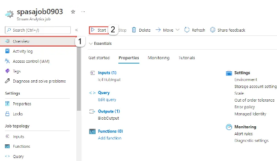
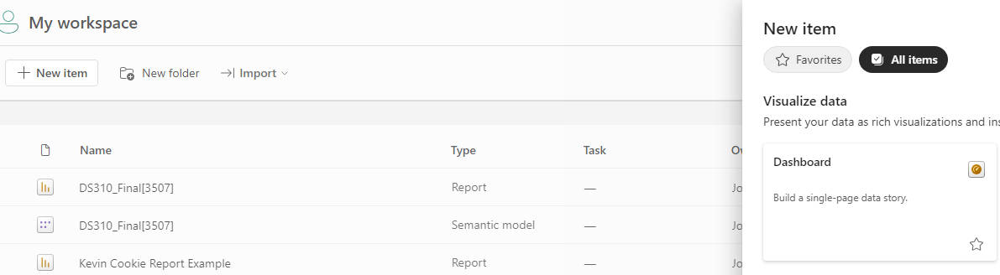
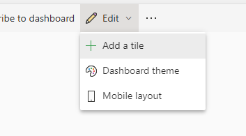
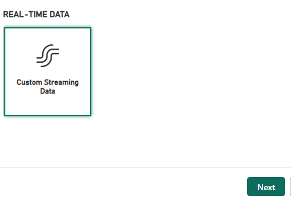
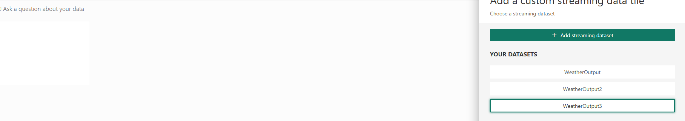
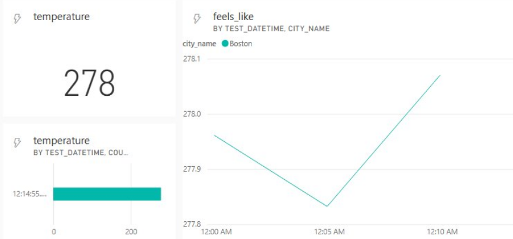

# HW4: Stream Analytics

**Objective:**

Set up a real-time data processing pipeline using Azure Stream Analytics to store real-time weather and air pollution data from Azure Event Hubs. The goal is to have the data will be processed on the fly and sent into PowerBI for a live dashboard.

>💡 ***What is Azure Stream Analytics?***
[Azure Stream Analytics](https://learn.microsoft.com/en-us/azure/stream-analytics/) is a real-time analytics service provided by Microsoft Azure that is designed to process and analyze streaming data from various sources such as IoT devices, applications, sensors, logs, and social media. It enables you to develop and deploy real-time analytics solutions that can ingest large volumes of data and provide insights within seconds to minutes. In this homework, Azure Stream Analytics is being used to process and analyze real-time weather and air pollution data that is being ingested from Azure Event Hubs. The key objectives for using Azure Stream Analytics in this scenario include:
**Real-Time Data Processing**: Azure Stream Analytics is set up to process data as it arrives in real-time from the Event Hub. This allows you to handle continuous data streams and transform or filter the data immediately as it is received.
**Data Transformation**: The incoming weather and pollution data need to be formatted to match the structure of the historical data that was previously ingested and stored in the Bronze layer of Azure Data Lake Storage. Stream Analytics enables you to write SQL-like queries that can reformat, filter, and manipulate the data so that it matches the required schema.
**Data Ingestion into Azure Data Lake Storage**: After processing, the Stream Analytics job outputs the transformed data into Azure Data Lake Storage, specifically into the Bronze layer. This layer is intended for storing raw data, but in this case, the data must be formatted similarly to the historical data for consistency.

### Steps:

### 1. Set Up Azure Stream Analytics Job

- **Create a Stream Analytics Job**:
    - **Streaming Units**: Set to 1/3 to save costs.
    >💡 **Streaming Units** determine the processing resources available to your Stream Analytics job, including CPU and memory. A higher number of SUs allows your job to handle more data and more complex queries, but will increase the cost.

If you created a Stream Analytics job with **streaming units with N**, it will be billed **$0.11 * N/hour**.

### 2. Configure Inputs for the Stream Analytics Job
- Add Event Hub as an Input
    >💡In Azure Stream Analytics, **inputs** refer to the data sources that the Stream Analytics job reads from to perform real-time processing. These inputs are the *starting point* for the stream processing pipeline, where data is ingested and then analyzed using the Stream Analytics queries.
- Navigate to your Stream Analytics job.
- In the left menu, select "Inputs" under the "Job topology" section.
- Click "+ Add stream input" and select "Event Hub."
- Configure the input with the following details:
    - **Input alias**: [insert here]
    - **Subscription**: Select your subscription.
    - **Event Hub namespace**: Select your Event Hub namespace.
    - **Event Hub name**: [insert here]
    - **Event Hub consumer group**: Use existing.
    - **Authentication mode**: Connection string.
    - **Event Hub policy name**: Use existing (e.g., `RootManageSharedAccessKey`).
    - **Event serialization format**: JSON.
    - **Encoding**: UTF-8.


### 3. Configure Outputs for the Stream Analytics Job
**Create an Outputs (PowerBI) for Historical Weather and Historical Air Pollution data.**
- In the left menu, select "Outputs" under the "Job topology" section.
- Click "+ Add" and select "Power BI."
- Configure the output with the following details:
    - **Output alias**: [insert here]
          - This is just the name of what shows up in Stream Analytics
    - **Subscription**: Select your subscription.
    - **Dataset Name**: Name your dataset to be reflected in PowerBI.
    - **Table Name**: [insert here]
    - **Event Serialization Format**: JSON.
- Click "Save."

### 4. Configure Query for the Stream Analytics Job
Feel free to add more fields you wish to visualize. The below fields are a small example of what you could pull from the data being streamed into event hubs (remember that both air pollution and weather data are being streamed together).
```sql
    WITH FlattenedWeather AS (
    SELECT
        System.Timestamp() AS test_datetime, #not used, but interesting to compare
        input.weather.coord.lon AS longitude,
        input.weather.coord.lat AS latitude,
        input.weather.name AS city_name,
        input.weather.main.temp AS temperature,
        input.weather.main.feels_like AS feels_like,
        input.weather.main.pressure AS pressure,
        input.weather.main.humidity AS humidity,
        input.weather.wind.speed AS wind_speed,
        input.weather.wind.deg AS wind_direction,
        input.weather.sys.country AS country,
        input.weather.sys.sunrise AS sunrise,
        input.weather.sys.sunset AS sunset, ...#could add more fields!
    FROM ["name of your event hub input in stream analytics "] AS input
    TIMESTAMP BY DATEADD(SECOND, input.weather.dt, '1970-01-01T00:00:00Z') 
    #the above line is to overwrite the timestamp of the data to be that of the API instead of the Azure system
    CROSS APPLY GetArrayElements(input.weather.weather) AS weather_item
)
SELECT * INTO ["Output alias for PowerBI"] FROM FlattenedWeather;
```

**Debugging**
1. Input the query
2. Start the Azure Function App and wait for the data to be sent to Stream Analytics
3. Test each query and debug any errors

>💡 If you created a debugging data file in HW3, you can upload that same data file as **sample input** to be used for output testing.

### 5. Start the Azure Function App and Enable Event Hubs
- Navigate to your Function App 
- Click on the "Start" button to start the function app.
- Ensure that the Function App is running and ingesting data into the Event Hub.

### 5. Start the Stream Analytics Job

>💡 ***What happens when you start a Stream Analytics Job?***
The stream analytics job first provisions needed resources based on the number of Streaming Units (SUs) you've configured for the job.
It then establishes connections to its configured input sources. This might include Azure Event Hubs, IoT Hubs, Blob Storage, or other data streams.
The SQL-like queries you have defined in your Stream Analytics job are now actively executed on the incoming data as it flows in from the inputs.

### 7. Connect to PowerBI
1. Go to PowerBI **browser** and sign in with your BU account
2. Go to My Workspace and create a dashboard

3. Edit --> Add a tile --> Custom Streaming Data

4. If Event Hubs + Stream Analytics was done correctly, the name of your dataset should appear **automatically**

5. Begin to create visualizations. Remember that for time series data it requires the timestamp to be correctly identified. The provided SQL query should do this for you.
6. Watch the visualization update in real time! Best dashboard gets displayed in discussion :) 



### 8. Stop the Azure Function App and Stream Analytics Job

1. **Stop the Function App**:
    - Navigate to your Function App.
    - Click on the "Stop" button to stop the function app from running.
2. **Stop the Stream Analytics Job**:
    - Navigate to the "Overview" section of your Stream Analytics job.
    - Click "Stop" to stop the job from running.
    

### 9. Submit PowerBI screenshot to Gradescope
- **Include your Profile + BU Email in the top right corner**
