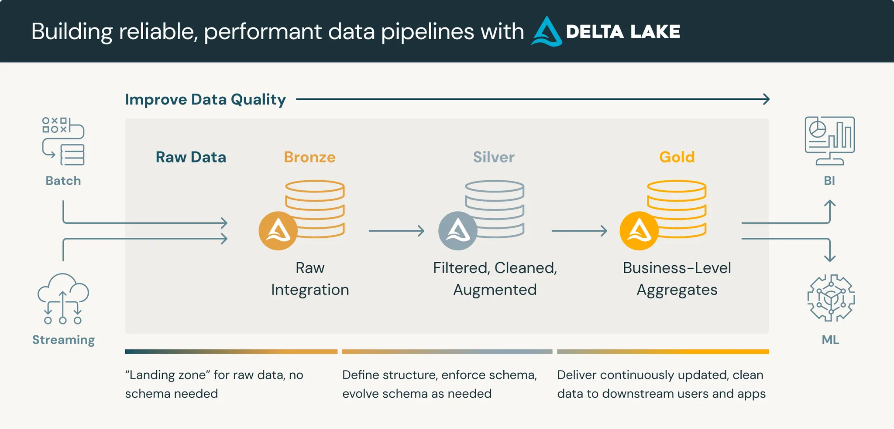
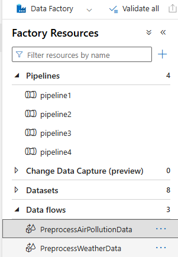
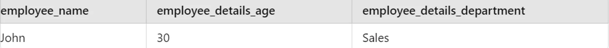
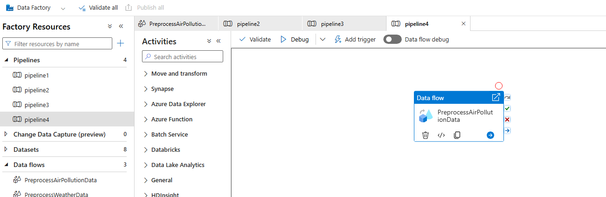
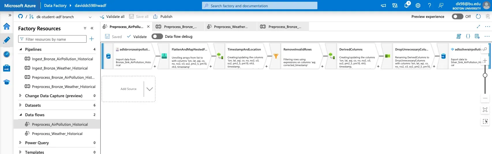
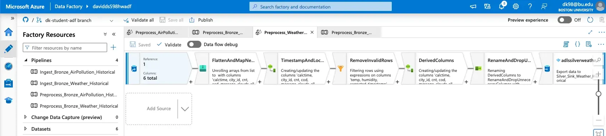
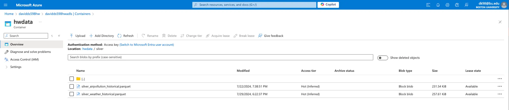

# HW5: Dataflow and Silver Layer

**Objective:**
Clean and preprocess the historical/stream data ingested from the OpenWeather APIs using Azure Data Factory. This involves handling missing values, correcting data types, and transforming the data to make it suitable for analysis. The processed data will be stored in the Silver layer of Azure Data Lake Storage. We will be utilizing Data Flows. 
>💡 ***What is the Silver Layer in the Medallion Architecture?***

According to Databricks, the [**Silver Layer**](https://www.databricks.com/glossary/medallion-architecture) is where data from the Bronze layer is matched, merged, conformed and cleansed enough so that the Silver layer can provide an "Enterprise view" of all its key business entities, concepts and transactions.  This “Enterprise view” consists of data consolidation, standardization and normalization, cleansing, deduplication, etc.\
The silver layer brings the data from different sources into an Enterprise view and enables self-service analytics for ad-hoc reporting, advanced analytics and ML. It serves as a source for Departmental Analysts, Data Engineers and Data Scientists to further create projects and analysis to answer business problems via enterprise and departmental data projects in the Gold Layer.

>💡
***Dataflow vs Regular Pipeline?***
A [dataflow](https://www.notion.so/81190f6b2f7d4572bde3903b1e47c7e6?pvs=21) in Azure Data Factory is a graphical data transformation tool that allows users to design, build, and execute data transformation logic using a drag-and-drop interface. It is ideal for complex data transformation scenarios where you need to transform, cleanse, or enrich data as it moves from source to sink. Regular data pipelines are better suited for simple data movement tasks, orchestration, and lightweight data processing.


### Steps:

### 1. Create Data Flow for Weather Data Preprocessing

>💡***What is a Dataflow?***
[Data flows](https://learn.microsoft.com/en-us/azure/data-factory/concepts-data-flow-overview) in Azure are visually designed data transformations, allowing Data Engineers  to develop data **transformation logic without writing code**. Here's why data flows in Azure are so powerful (compared to simply using pipelines):
**Reusability:** can be embedded in pipelines, allowing for reusable and modular components in an enterprise data architecture
**Complex Transformations:** data flows support a wide range of transformations like joins, aggregations, window functions, pivots, lookups, and conditional splitting, making it flexible for any ETL or ELT workload
**Spark:** Data flow performance is optimized by running transformations in parallel using Spark, which makes it highly scalable for large datasets.


1. Create a Data Flow in ADF


2. **Source Transformation**
- Weather Data from Bronze Layer
- There are multiple JSON weather files, so utilize ‘wildcard paths’

    >💡 ***What are Wildcard Paths?***
    [Wildcard Paths](https://azure.microsoft.com/en-us/updates/data-factory-supports-wildcard-file-filter-for-copy-activity/) in Azure Data Factory allow you to **specify a pattern for selecting files** in a directory, making it easier to work with multiple files that share a similar naming structure. For example, you can use **“*”** to match any sequence of characters and **“?”** to match a single character. This feature is especially useful for operations like copying or processing files in bulk, where the files follow a consistent naming convention but may have different suffixes or prefixes. 
    For example, using a wildcard path like **directory_path/*.json** will include all files with a .json extension in the specified directory, enabling batch processing *without needing to specify each file individually.*
    
- Make sure you import schema within the dataset
- Import projection on the projection tab
    
    >💡 In Azure Data Factory, **projection** refers to the process of defining the structure of the data that will be output from a transformation or source in a data flow. It specifies the columns, data types, and hierarchical organization of the data, helping to ensure that the data flow operates correctly and that subsequent transformations receive the data in the expected format.

3. **Flatten and Map Nested Fields Transformation:**
    - Add a Flatten transformation to flatten the JSON structure.
        >💡 ***What is Flatten Transformation?***
        [**Flatten transformation**](https://learn.microsoft.com/en-us/azure/data-factory/data-flow-flatten) in Azure Data Factory's Data Flow is used to transform hierarchical or nested data structures, such as JSON arrays or objects, into a flat, tabular format. This is particularly useful when working with complex data sources like JSON, where you may have *nested arrays* or objects that need to be converted into a more accessible, *columnar format* for further processing or analysis. 
            Ex:
            ```json
            {
            "employee": {
                "name": "John",
                "details": {
                "age": 30,
                "department": "Sales"
                }
            }
            }
            ```
        
    - **Input columns:** Map the nested fields to simple column names, as shown below:
        - `calctime` -> `calctime`
        - `city_id` -> `city_id`
        - `cnt` -> `cnt`
        - `cod` -> `cod`
        - `message` -> `message`
        - `list.clouds.all` -> `clouds_all`
        - `list.dt` -> `timestamp`
        - `list.main.feels_like` -> `feels_like`
        - `list.main.humidity` -> `humidity`
        - `list.main.pressure` -> `pressure`
        - `list.main.temp` -> `temp`
        - `list.main.temp_max` -> `temp_max`
        - `list.main.temp_min` -> `temp_min`
        - `list.weather.description` -> `weather_description`
        - `list.weather.icon` -> `weather_icon`
        - `list.weather.id` -> `weather_id`
        - `list.weather.main` -> `weather_main`
        - `list.wind.deg` -> `wind_deg`
        - `list.wind.gust` -> `wind_gust`
        - `list.wind.speed` -> `wind_speed`
        - Optional (May not exist): `list.rain.{1h}` -> `rain_1h`
    
4. **Derived Column Transformation to Create `corrected_timestamp` and `location`:**
    - **Timestamp Correction**: The current dataset contains Unix timestamps exceeding 10 digits.
        >💡 If a timestamp exceeds 10 digits, it usually indicates a timestamp in milliseconds (13 digits) or microseconds (16 digits). In most systems, timestamps are expected to be in seconds (10 digits), so exceeding 10 digits can cause errors or misinterpretations unless the system is designed to handle higher precision.
    - **Solution**: Implement a derived column named ***corrected_timestamp*** using the “**iif function**” to convert any timestamps not conforming to the 10-digit format into null().
        >💡 The [**iif function**](https://support.microsoft.com/en-us/office/iif-function-32436ecf-c629-48a3-9900-647539c764e3) is part of Azure Data Factory's Data Flow expression language. It is used to evaluate a condition and return one of two values depending on whether the condition is true or false. It's similar to the "IF" function in other programming languages.
    - **Alternative**: Optionally, utilize the filter function for timestamp validation and correction as needed.
        >💡 Using a **filter function** in a data processing workflow allows you to identify and either *correct* or *exclude* records with invalid or incorrect timestamps.
    - **Location Specification**: Establish a consistent location identifier for the dataset.
        >💡 For our OpenWeather data, establishing a consistent location identifier is crucial because weather data is inherently tied to specific geographical locations. Without a consistent identifier, it would be challenging to accurately aggregate, compare, or analyze weather data across different datasets or over time. 
        **Homework Implementation**: Introduce a location column, assigning the value ‘Boston’ to all entries to standardize the data set’s geographical reference.
        
5. **Filter Transformation to Remove Invalid Rows:**
    - Add a Filter transformation to remove rows with missing values in critical columns like temperature and humidity, and invalid timestamps.
    - **Derived Column Transformation to Create `date_time`, `id`, and Extract and Transform Data:**
            >💡 [**Derived columns**](https://learn.microsoft.com/en-us/azure/data-factory/data-flow-derived-column) are columns created within a data transformation process to calculate new values or modify existing ones based on expressions or logic applied to the data. In Azure Data Factory's Data Flow, derived columns allow you to manipulate data by performing operations such as: 
        - **Converting data types** (e.g., converting a string to a date).
        - **Calculating new values** based on existing columns (e.g., converting temperatures from Kelvin to Celsius).
        - **Cleaning data** (e.g., replacing invalid or missing values).
        >💡 We want to create a **series of derived columns** for calculating several important data weather points. This will be done by either applying calculations on pre-existing data fields or augmenting/modifying data into new fields. Below are a list of fields we want to create to better understand the OpenWeather data.
    - **Derived Column Expressions:**
        - **`date_time`** → Convert the `corrected_timestamp` data field into a datetime format.
            >💡 Recall that [datetime](https://learn.microsoft.com/en-us/rest/api/storageservices/formatting-datetime-values) represents milliseconds. We need to convert the *corrected_timestamp* field into milliseconds by multiplying it appropriately.
    Another consideration is that some timestamps exceed the 32 bit representation when converted to milliseconds. To prevent overflow, we should convert the timestamp to 64 bit representation using ***toLong()***. 
    Finally, we can convert this 64 bit representation to datetime using ***toTimestamp()*.**
        - **`id`** → Create a unique ID by concatenating `location` and `corrected_timestamp`.
        - **`temp_C`** → Convert temperature from Kelvin to Celsius, and round this value.
            >💡 OpenWeather by default provides temperature in ***Kelvin***. We need derived columns to properly convert these to metrics that would be more useful for us. From Celsius to Kelvin, it would be the Kelvin temperature - **273.15**
        
        - **`temp_min_C`** → Convert `temp_min` from Kelvin to Celsius, and round this value.
        - **`temp_max_C`** → Convert `temp_max` from Kelvin to Celsius, and round this value.
        - **`feels_like_C`** → Convert and round `feels_like` to Celsius.
        - **`temp_min_C`** → Convert and round `temp_min` to Celsius.
        - **`temp_max_C`** → Convert and round `temp_max` to Celsius.
        - **`feels_like_F`** → Convert and round `feels_like` to Fahrenheit.
        - **`temp_min_F`** → Convert and round `temp_min` to Fahrenheit.
        - **`temp_max_F`** → Convert and round `temp_max` to Fahrenheit
        - **`lon`** & **`lat`** → Assign fixed longitude and latitude values(Boston)
            >💡 Boston Coordinates are latitude= 42.3601, longitude = -71.0589
        - **`weather_id_value`** → Extract and convert the weather ID from a string to an integer.
        - **`weather_main_value`, `weather_description_value`, `weather_icon_value`** → Extract specific weather details from strings.
            >💡 For each of these fields, you first need to access the corresponding value from the original API response. Since the data may be nested or part of a more complex string, you'll isolate the identifying value by using string manipulation techniques, such as `split` to divide the string at a specific delimiter, and then selecting the relevant part. Finally, convert or format the value as needed (e.g., converting a string to an integer with `toInteger()`).
                Here is the code to get you started:
                [Link to Example API Output](https://openweathermap.org/weather-conditions)
                - **`toString(weather_id[1])`**: Convert the value in the `weather_id` array to a string.
                - **`split(..., ': ')[1]`**: Split the string by `':'` and take the part after the colon, which is the identifier.
                - **`toInteger(...)`**: Convert this extracted value to an integer.
                
                Also remember that we remapped columns such as *weather.id* → *weather_id*, thus we use the newly mapped variables in the derived column calculations going onward. 
        - **`rain_1h`** → Handle missing `rain_1h` values by setting them to 0.0 if null.
            >💡 If rain exists: 
            *rain_1h = iif(isNull(rain_1h), toFloat(0.0), toFloat(rain_1h))*
            
    
6. **Select Transformation to Rename and Drop Unnecessary Columns:**
        - Add a Select transformation to rename the temperature columns and drop unnecessary columns:
    - Rename columns:
        - `temp` -> `temp_K`
        - `feels_like` -> `feels_like_K`
        - `temp_min` -> `temp_min_K`
        - `temp_max` -> `temp_max_K`
    - Drop the following columns:
        - `timestamp`
        - `calctime`
        - `cod`
        - `message`
        - `cnt`
        - `city_id`
        - `weather_description`
        - `weather_icon`
        - `weather_id`
        - `weather_main`
7. **Sink Transformation:**
    - Add a sink transformation to write the processed data to the Silver layer in Azure Data Lake Storage.
    - File Format: Parquet
        >💡 ***What is Parquet?***
        [Parquet](https://learn.microsoft.com/en-us/azure/data-factory/format-parquet) is a columnar storage file format that is optimized for use with data processing systems. It was developed as part of the Apache Hadoop ecosystem and is widely used for storing large-scale data in a way that supports efficient querying and analytics.
    
    **Considerations:**
    - **Output to Single File:** This option combines all the data into a single file, which can simplify downstream processing and file management. However, it may increase the execution time and memory usage, especially for large datasets.
    - **Partitioning:** Using "Single partition" can simplify the dataset but might not be efficient for very large datasets. The recommended industry standard is to balance between manageability and performance. For very large datasets, consider using current partitioning to distribute the data across multiple files.

### 2. Create Data Flow for Air Pollution Data Preprocessing
1. **Create a Data Flow for preprocessing air pollution data.**
2. **Source Transformation:**
    - Add a source transformation to read the air pollution data from the Bronze layer in Azure Data Lake Storage.
    - Hint:
        - Make sure you import schema within the dataset
        - Import projection on the projection tab
3. **Flatten and Map Nested Fields Transformation:**
    - Add a Flatten transformation to flatten the JSON structure.
        - https://learn.microsoft.com/en-us/azure/data-factory/data-flow-flatten
4. **Derived Column Transformation to Create `corrected_timestamp` and `location`:**
    - add a Derived Column transformation to handle the timestamp correction and set location.
        - **`corrected_timestamp = if(length(toString(timestamp)) == 10, toInteger(timestamp), toInteger(null()))`**
        - **`location = 'Boston'`**
5. **Filter Transformation to Remove Invalid Rows:**
    - Add a Filter transformation to remove rows with missing values in critical columns like AQI and invalid timestamps. (use **&&** to check both conditions)
6. **Derived Column Transformation** 
    >💡These transformations will be similar (if not identical) to the transformations you’ve done for the prior dataflow in terms of logic. 
    - Convert ‘corrected_timestamp’ (UNIX timestamp) to date time.
    - Create an ‘id’ column (same procedure as weather)
    - Also, round the pollutant metrics to 2 decimal places.
7. **Select Transformation to Drop Unnecessary Columns:**
    - Add a Select transformation to drop the unnecessary columns such as `timestamp`.
8. **Sink Transformation:**
- Add a sink transformation to write the processed data to the Silver layer in Azure Data Lake Storage.
- File Format: Parquet.
    >💡 Understand that the same considerations from the prior data flow apply here also.
### 3. Create Pipelines to Run Data Flows

1. **Create a Pipeline for Weather Data Preprocessing Data Flow**
2. **Create a Pipeline for Air Pollution Data Preprocessing Data Flow**

### 4. Trigger the Pipelines Now
1. **Trigger the Pipelines**
2. **Monitor the Pipeline Run**

### Additional Information:

For `weather_description`, `weather_icon`, `weather_main`, and `weather_id`, the values can be extracted from strings formatted like `weather_id[1]: 804`. Use string manipulation functions to extract the value after `': '`. This information can be used for visualization later as explained on the OpenWeatherMap [weather conditions](https://openweathermap.org/
weather-conditions) page.

### Additional Information:
For `weather_description`, `weather_icon`, `weather_main`, and `weather_id`, the values can be extracted from strings formatted like `weather_id[1]: "..."`. Use string manipulation functions to extract the value after `': '`. This information can be used for visualization later as explained on the OpenWeatherMap [weather conditions](https://openweathermap.org/weather-conditions) page.

### Deliverables:

- **Screenshot of Pipelines:** Screenshots of the pipeline configurations for weather and air pollution data.
    
    
    
    
    
- **Screenshot of Monitor Tab:** A screenshot showing the successful run of the pipelines in the Monitor tab.
    
    
    
- **Screenshot of Data in Azure Data Lake Storage (Silver Layer):** A screenshot showing the cleaned and transformed data stored in the Silver layer.
    
    