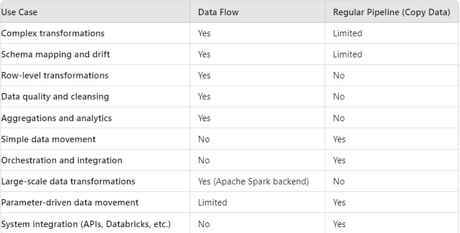
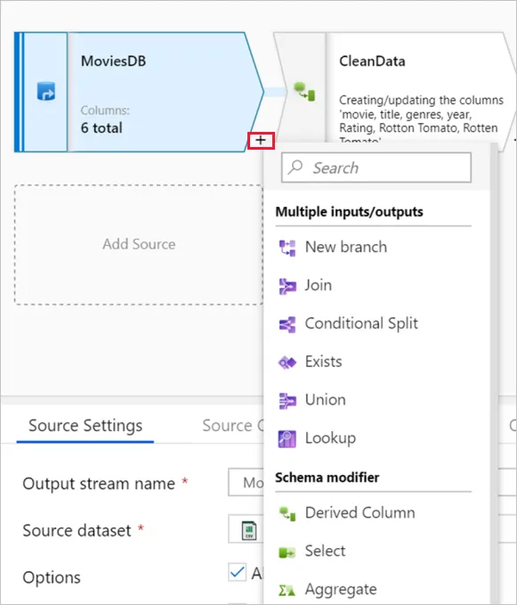
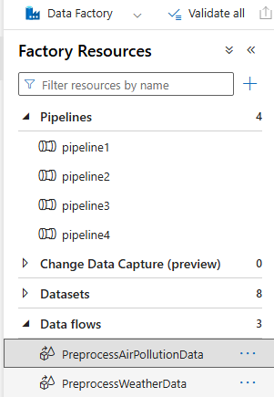

# HW3: Event Hubs and Azure Functions

**Objective:**
Clean and preprocess the historical/stream data ingested from the OpenWeather APIs using Azure Data Factory. This involves handling missing values, correcting data types, and transforming the data to make it suitable for analysis. The processed data will be stored in the Silver layer of Azure Data Lake Storage. We will be utilizing Data Flows. 
>💡 ***What is the Silver Layer in the Medallion Architecture?***

According to Databricks, the [**Silver Layer**](https://www.databricks.com/glossary/medallion-architecture) is where data from the Bronze layer is matched, merged, conformed and cleansed enough so that the Silver layer can provide an "Enterprise view" of all its key business entities, concepts and transactions.  This “Enterprise view” consists of data consolidation, standardization and normalization, cleansing, deduplication, etc.\
The silver layer brings the data from different sources into an Enterprise view and enables self-service analytics for ad-hoc reporting, advanced analytics and ML. It serves as a source for Departmental Analysts, Data Engineers and Data Scientists to further create projects and analysis to answer business problems via enterprise and departmental data projects in the Gold Layer.

>💡
***Dataflow vs Regular Pipeline?***
A [dataflow](https://www.notion.so/81190f6b2f7d4572bde3903b1e47c7e6?pvs=21) in Azure Data Factory is a graphical data transformation tool that allows users to design, build, and execute data transformation logic using a drag-and-drop interface. It is ideal for complex data transformation scenarios where you need to transform, cleanse, or enrich data as it moves from source to sink. Regular data pipelines are better suited for simple data movement tasks, orchestration, and lightweight data processing.


### Steps:

### 1. Create Data Flow for Weather Data Preprocessing

>💡***What is a Dataflow?***
[Data flows](https://learn.microsoft.com/en-us/azure/data-factory/concepts-data-flow-overview) in Azure are visually designed data transformations, allowing Data Engineers  to develop data **transformation logic without writing code**. Here's why data flows in Azure are so powerful (compared to simply using pipelines):
**Reusability:** can be embedded in pipelines, allowing for reusable and modular components in an enterprise data architecture
**Complex Transformations:** data flows support a wide range of transformations like joins, aggregations, window functions, pivots, lookups, and conditional splitting, making it flexible for any ETL or ELT workload
**Spark:** Data flow performance is optimized by running transformations in parallel using Spark, which makes it highly scalable for large datasets.


1. Create a Data Flow in ADF


2. **Source Transformation**
- Weather Data from Bronze Layer
- There are multiple JSON weather files, so utilize ‘wildcard paths’

    >💡 ***What are Wildcard Paths?***
    [Wildcard Paths](https://azure.microsoft.com/en-us/updates/data-factory-supports-wildcard-file-filter-for-copy-activity/) in Azure Data Factory allow you to **specify a pattern for selecting files** in a directory, making it easier to work with multiple files that share a similar naming structure. For example, you can use **“*”** to match any sequence of characters and **“?”** to match a single character. This feature is especially useful for operations like copying or processing files in bulk, where the files follow a consistent naming convention but may have different suffixes or prefixes. 
    For example, using a wildcard path like **directory_path/*.json** will include all files with a .json extension in the specified directory, enabling batch processing *without needing to specify each file individually.*
    
- Make sure you import schema within the dataset
- Import projection on the projection tab
    
    >💡 In Azure Data Factory, **projection** refers to the process of defining the structure of the data that will be output from a transformation or source in a data flow. It specifies the columns, data types, and hierarchical organization of the data, helping to ensure that the data flow operates correctly and that subsequent transformations receive the data in the expected format.

3. **Flatten and Map Nested Fields Transformation:**
    - Add a Flatten transformation to flatten the JSON structure.
        >💡 ***What is Flatten Transformation?***
        [**Flatten transformation**](https://learn.microsoft.com/en-us/azure/data-factory/data-flow-flatten) in Azure Data Factory's Data Flow is used to transform hierarchical or nested data structures, such as JSON arrays or objects, into a flat, tabular format. This is particularly useful when working with complex data sources like JSON, where you may have *nested arrays* or objects that need to be converted into a more accessible, *columnar format* for further processing or analysis. 
            Ex:
            ```json
            {
            "employee": {
                "name": "John",
                "details": {
                "age": 30,
                "department": "Sales"
                }
            }
            }
            ```
        
    - **Input columns:** Map the nested fields to simple column names, as shown below:
        - `calctime` -> `calctime`
        - `city_id` -> `city_id`
        - `cnt` -> `cnt`
        - `cod` -> `cod`
        - `message` -> `message`
        - `list.clouds.all` -> `clouds_all`
        - `list.dt` -> `timestamp`
        - `list.main.feels_like` -> `feels_like`
        - `list.main.humidity` -> `humidity`
        - `list.main.pressure` -> `pressure`
        - `list.main.temp` -> `temp`
        - `list.main.temp_max` -> `temp_max`
        - `list.main.temp_min` -> `temp_min`
        - `list.weather.description` -> `weather_description`
        - `list.weather.icon` -> `weather_icon`
        - `list.weather.id` -> `weather_id`
        - `list.weather.main` -> `weather_main`
        - `list.wind.deg` -> `wind_deg`
        - `list.wind.gust` -> `wind_gust`
        - `list.wind.speed` -> `wind_speed`
        - Optional (May not exist): `list.rain.{1h}` -> `rain_1h`
    
4. **Derived Column Transformation to Create `corrected_timestamp` and `location`:**
    - **Timestamp Correction**: The current dataset contains Unix timestamps exceeding 10 digits.
        >💡 If a timestamp exceeds 10 digits, it usually indicates a timestamp in milliseconds (13 digits) or microseconds (16 digits). In most systems, timestamps are expected to be in seconds (10 digits), so exceeding 10 digits can cause errors or misinterpretations unless the system is designed to handle higher precision.
    - **Solution**: Implement a derived column named ***corrected_timestamp*** using the “**iif function**” to convert any timestamps not conforming to the 10-digit format into null().
        >💡 The [**iif function**](https://support.microsoft.com/en-us/office/iif-function-32436ecf-c629-48a3-9900-647539c764e3) is part of Azure Data Factory's Data Flow expression language. It is used to evaluate a condition and return one of two values depending on whether the condition is true or false. It's similar to the "IF" function in other programming languages.
    - **Alternative**: Optionally, utilize the filter function for timestamp validation and correction as needed.
        >💡 Using a **filter function** in a data processing workflow allows you to identify and either *correct* or *exclude* records with invalid or incorrect timestamps.
    - **Location Specification**: Establish a consistent location identifier for the dataset.
        >💡 For our OpenWeather data, establishing a consistent location identifier is crucial because weather data is inherently tied to specific geographical locations. Without a consistent identifier, it would be challenging to accurately aggregate, compare, or analyze weather data across different datasets or over time. 
        **Homework Implementation**: Introduce a location column, assigning the value ‘Boston’ to all entries to standardize the data set’s geographical reference.
        
  