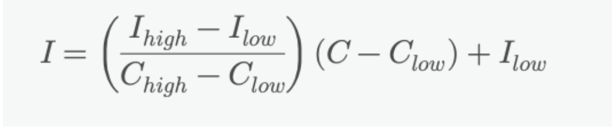
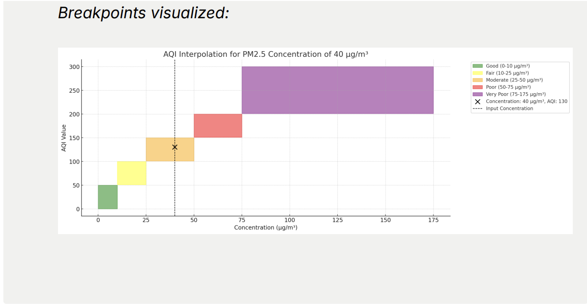
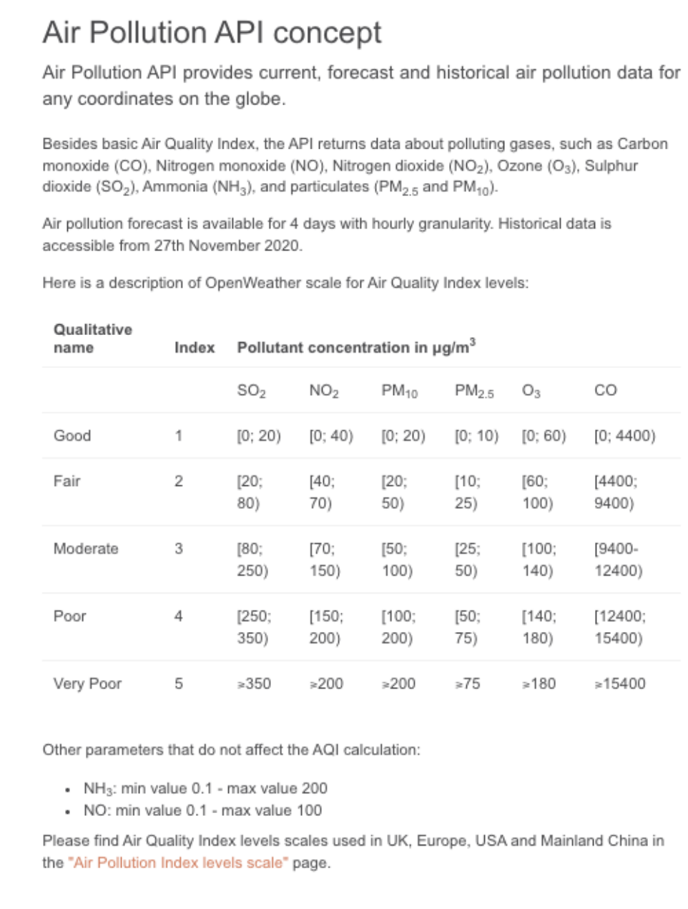
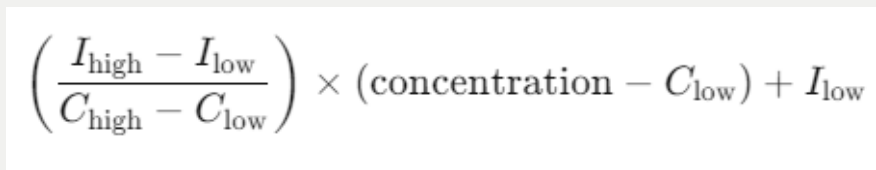
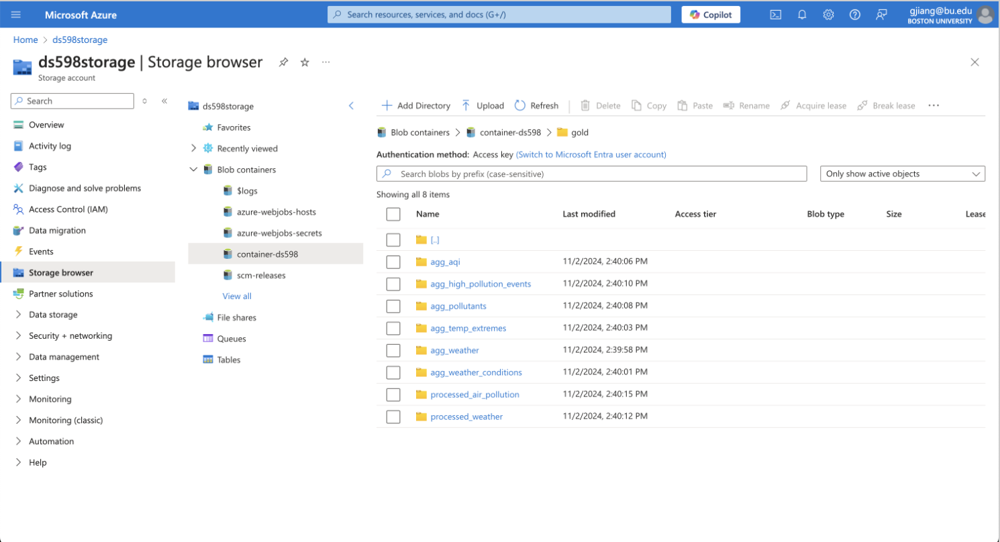
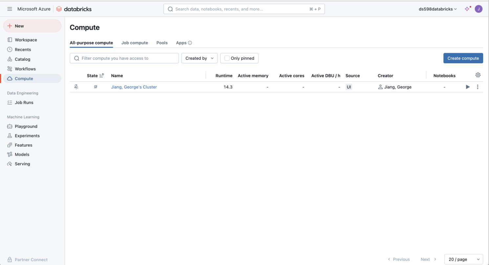

**Objective**: Perform batch processing on the preprocessed data to handle large-scale data transformations and aggregations using Azure Synapse with PySpark. The processed data will be stored in the Gold layer of Azure Data Lake Storage.

**Tools**: Azure Synapse, PySpark, Azure Data Lake Storage


💡 ***What is Apache Spark?*
[Apache Spark](https://learn.microsoft.com/en-us/azure/databricks/spark/)** is an open-source, distributed processing system designed for big data workloads. It provides *in-memory computing*, which speeds up data processing tasks, etc. It is the underlying distributed data processing engine used by Synapse, which is a cloud-based platform that provides a collaborative environment for data engineering, data science, and machine learning. When you deploy a compute cluster or SQL warehouse on Azure Synapse, Apache Spark is configured and deployed to virtual machines. You don’t need to configure or initialize a [Spark context or Spark session](https://www.notion.so/HW7-Batch-Processing-c41cbdf25444472aa84f9680514868df?pvs=21), as these are managed for you by Azure. It uses lazy evaluation to process transformations and actions defined with DataFrames.

- **DataFrames** are the primary objects in Apache Spark. A DataFrame is a dataset organized into named columns. You can think of a DataFrame like a spreadsheet or a SQL table, a two-dimensional labeled data structure of a series of records and columns of different types. They also provide a rich set of functions that allow you to perform common data manipulation and analysis tasks efficiently.
- Transformations: In Spark you express processing logic as transformations, which are instructions for loading and manipulating data using DataFrames. Common transformations include reading data, joins, aggregations, and type casting.
- **Lazy Evaluation**: Spark optimizes data processing by identifying the most efficient physical plan to evaluate logic specified by transformations. However, Spark does not act on transformations until actions are called. Rather than evaluating each transformation in the exact order specified, Spark *waits until an action triggers computation on all transformations*. Spark handles their execution in a deferred manner, rather than immediately executing them when they are defined.

>
💡 ***What is PySpark?*   [PySpark](https://learn.microsoft.com/en-us/azure/databricks/pyspark/)** is the Python API for Apache Spark, an open-source distributed computing system that enables large-scale data processing. PySpark allows you to use Python to interact with Spark’s capabilities, such as in-memory data processing, distributed machine learning, and graph processing. It's commonly used for big data analytics, enabling you to process large datasets efficiently across a cluster of machines. PySpark integrates seamlessly with other big data tools, including Hadoop, and is widely used in data engineering, data science, and machine learning projects

</aside>

<aside>
💡 ***What is the Gold Layer?***
The **Gold Layer** represents the highest quality of data in the architecture, enabling decision-makers and analysts to derive insights and make informed decisions based on reliable and well-structured data.

</aside>

### Steps:

### 1. Create a New Notebook in Synapse

1. **Create a New Notebook**

### 2. Load Data into Synapse (Same as HW 4)

1. **Set up Access to Azure Data Lake Storage**
    - In your Synapse notebook, configure access to your ADLS account using the storage account name and key.
    
    >
    💡
    
    **`wasbs://`**: This is the protocol used to access Azure Blob Storage. "wasbs" stands for "Windows Azure Storage Blob Secure," indicating that the connection is secure.
    
    **`{container}`**: This placeholder will be replaced by the name of the blob **container** you want to access. A container in Azure Blob Storage is similar to a directory where blobs (files) are stored.
    
    ```python
    # Read data directly from ADLS Gen2
    container_name = ""
    air_pollution_folder_path = ""  # Folder, not a single file
    historical_weather_folder_path = ""

    # Read all JSON files in the folder
    air_pollution_df = spark.read.json(f"abfss://{container_name}@{storage_account_name}.dfs.core.windows.net/{air_pollution_folder_path}")
    historical_weather_df = spark.read.json(f"abfss://{container_name}@{storage_account_name}.dfs.core.windows.net/{historical_weather_folder_path}")
    # Show the DataFrame
    ```
    
    `{mount_name}` placeholder will be replaced with the actual name you want to use for this mount point, which is the directory in your local file system where an external storage resource (like Azure Blob Storage, in this case) is made accessible.
    
    ```jsx
    Example: mount_name = "processed_data" (If the container is used 
    for data that has been cleaned or processed.)
    ```
    
    </aside>
    
    ```python
    # Set up the configuration for accessing the storage account
    storage_account_name = "your_storage_account_name"
    storage_account_key = "your_storage_account_key"
    container = "your_container_name"
    
    # Set Spark config to access the storage account
    spark.conf.set(
        f"fs.azure.account.key.{storage_account_name}.dfs.core.windows.net",
        storage_account_key
    )
    
    # Define ABFSS path
    abfss_path = f"abfss://{container}@{storage_account_name}.dfs.core.windows.net/"
    
    # Example: reading a Parquet file from ADLS Gen2
    df = spark.read.parquet(f"{abfss_path}path/to/your/file.parquet")
    df.show()
    
    ```
    
2. **Load Data into DataFrame**:
    - Load the data from the ADLS container into a DataFrame for analysis.
    
    ```python
    # Load the weather data from the silver layer
    weather_df = spark.read.parquet(f"/mnt/{mount_name}/silver/silver_weather_historical.parquet")
    
    # Load the air pollution data
    air_pollution_df = spark.read.parquet(f"/mnt/{mount_name}/silver/silver_airpollution_historical.parquet")
    
    ```
    

### 3. Data Processing

1. **Recalculate AQI for Air Pollution Data**
    
    ```python
    from pyspark.sql.functions import col
    import pyspark.sql.functions as F
    from pyspark.sql.window import Window
    from pyspark.sql.types import IntegerType
    ```
    
    <aside>
    💡
    
    `pyspark.sql.functions` contains a wide variety of functions for data manipulation, including aggregation, string operations, mathematical functions, and more. 
    
    The `Window` class is used to define window specifications for performing window functions, such as ranking, cumulative sums, and moving averages, over specific partitions of data.
    
    - **Example**: `Window.partitionBy("category").orderBy("date")` creates a window specification to apply functions within each `category` partition ordered by `date`.
    </aside>
    
    ```python
    def calculate_aqi(pollutant, concentration):
        breakpoints = {
            'O3_8hr': [(0, 54, 0, 50), (55, 70, 51, 100), (71, 85, 101, 150), (86, 105, 151, 200), (106, 200, 201, 300)],
            'O3_1hr': [(125, 164, 101, 150), (165, 204, 151, 200), (205, 404, 201, 300), (405, 504, 301, 400), (505, 604, 401, 500)],
            'PM2.5_24hr': [(0, 12, 0, 50), (12.1, 35.4, 51, 100), (35.5, 55.4, 101, 150), (55.5, 150.4, 151, 200), (150.5, 250.4, 201, 300), (250.5, 350.4, 301, 400), (350.5, 500.4, 401, 500)],
            'PM10_24hr': [(0, 54, 0, 50), (55, 154, 51, 100), (155, 254, 101, 150), (255, 354, 151, 200), (355, 424, 201, 300), (425, 504, 301, 400), (505, 604, 401, 500)],
            'CO_8hr': [(0, 4.4, 0, 50), (4.5, 9.4, 51, 100), (9.5, 12.4, 101, 150), (12.5, 15.4, 151, 200), (15.5, 30.4, 201, 300), (30.5, 40.4, 301, 400), (40.5, 50.4, 401, 500)],
            'SO2_1hr': [(0, 35, 0, 50), (36, 75, 51, 100), (76, 185, 101, 150), (186, 304, 151, 200)],
            'SO2_24hr': [(305, 604, 201, 300), (605, 804, 301, 400), (805, 1004, 401, 500)],
            'NO2_1hr': [(0, 53, 0, 50), (54, 100, 51, 100), (101, 360, 101, 150), (361, 649, 151, 200), (650, 1249, 201, 300), (1250, 2049, 301, 400), (2050, 3049, 401, 500)],
        }
    
        if pollutant not in breakpoints:
            raise ValueError(f"Unsupported pollutant: {pollutant}")
    
        for (Clow, Chigh, Ilow, Ihigh) in breakpoints[pollutant]:
            if Clow <= concentration <= Chigh:
                return round(((Ihigh - Ilow) / (Chigh - Clow)) * (concentration - Clow) + Ilow)
    
        return None  # If the concentration is out of the given ranges
    ```
    
    <aside>
    💡
    
    **`calculate_aqi`** takes a pollutant type and concentration and maps it to an AQI value based on predefined breakpoints.
    
    **`Breakpoints`** dictionary in your **`calculate_aqi`** function defines the Air Quality Index (AQI) **breakpoints** for various pollutants. Each pollutant has its own set of **breakpoints**, which indicate the concentration levels at which the air quality transitions from one category to another (e.g., from Good to Moderate, Moderate to Unhealthy, etc.).
    
    - **`Clow`**: The lower bound of the concentration range.
    - **`Chigh`**: The upper bound of the concentration range.
    - **`Ilow`**: The lower bound of the AQI for this concentration range.
    - **`Ihigh`**: The upper bound of the AQI for this concentration range.
    
    Each key in the dictionary corresponds to a specific pollutant and its measurement duration (e.g., Ozone over 8 hours, PM2.5 over 24 hours, etc.).
    
    The formula ***((Ihigh - Ilow) / (Chigh - Clow)) * (concentration - Clow) + Ilow*** is used to map a pollutant's measured concentration to an AQI value that represents the potential health risk to the public. This allows for a continuous scale where *pollutant levels can be accurately associated with an AQI that fits within predefined health categories*. Here's a breakdown of the formula:

    
    
    - **`(Ihigh - Ilow) / (Chigh - Clow)`**: This calculates the slope of the AQI scale over the concentration range.
    - **`(concentration - Clow)`**: This represents how far the given concentration is from the lower bound of the concentration range.
    - **`(concentration - Clow)`**: This scales the AQI increment based on the distance from **`Clow`** to the actual **`concentration`**.
    - **`+ Ilow`**: This shifts the calculated AQI value to start from the lower bound **`Ilow`** of the AQI range.
    
    *Breakpoints visualized:*
    
    
    
    </aside>
    
    ```python
    def calculate_rolling_average(df, column, window):
        windowSpec = Window.partitionBy("location").orderBy("date_time").rowsBetween(-window+1, 0)
        return F.avg(column).over(windowSpec)
    
    def calculate_aqi_row(row):
        pollutant_map = {
            'o3_8hr': 'O3_8hr',
            'o3_1hr': 'O3_1hr',
            'pm2_5_24hr': 'PM2.5_24hr',
            'pm10_24hr': 'PM10_24hr',
            'co_8hr': 'CO_8hr',
            'so2_1hr': 'SO2_1hr',
            'so2_24hr': 'SO2_24hr',
            'no2_1hr': 'NO2_1hr'
        }
        aqi_values = []
    
        for col_name, pollutant in pollutant_map.items():
            concentration = row[col_name]
            if concentration is not None:
                aqi = calculate_aqi(pollutant, concentration)
                if aqi is not None:
                    aqi_values.append(aqi)
    
        if aqi_values:
            return max(aqi_values)
        return None
    
    def calculate_us_aqi(df):
        df = df.withColumn("o3_8hr", calculate_rolling_average(df, "o3", 8))
        df = df.withColumn("o3_1hr", df["o3"])
        df = df.withColumn("pm2_5_24hr", calculate_rolling_average(df, "pm2_5", 24))
        df = df.withColumn("pm10_24hr", calculate_rolling_average(df, "pm10", 24))
        df = df.withColumn("co_8hr", calculate_rolling_average(df, "co", 8))
        df = df.withColumn("so2_1hr", df["so2"])
        df = df.withColumn("so2_24hr", calculate_rolling_average(df, "so2", 24))
        df = df.withColumn("no2_1hr", df["no2"])
    
        **calculate_aqi_udf** = F.udf(lambda row: calculate_aqi_row(row), IntegerType())
        
        df = df.withColumn("us_aqi", calculate_aqi_udf(F.struct(
            col("o3_8hr"),
            col("o3_1hr"),
            col("pm2_5_24hr"),
            col("pm10_24hr"),
            col("co_8hr"),
            col("so2_1hr"),
            col("so2_24hr"),
            col("no2_1hr")
        )))
    
        return df
    
    air_pollution_df = calculate_us_aqi(air_pollution_df)
    ```
    
    <aside>
    💡
    
    **`calculate_rolling_average(df, column, window)`**computes the rolling average of a specified column over a given window of time.
    
    - `df`: The input DataFrame.
    - `column`: The column name for which the rolling average needs to be calculated.
    - `window`: The size of the rolling window (e.g., 8 hours, 24 hours).
    - A `WindowSpec` is created that partitions the data by `location` and orders it by `date_time`. The window spans from `window+1` to `0`, which includes the current row and the previous `window-1` rows.
    - returns the rolling average for the specified column using `F.avg(column).over(windowSpec)`.
    
    **`calculate_aqi_row(row)`**calculates the AQI for each row by considering all relevant pollutants and selecting the highest AQI value.**Implementation**
    
    - A dictionary `pollutant_map` is created to map column names in the DataFrame to pollutant categories recognized by the `calculate_aqi` function.
    - The function iterates over each pollutant, retrieves the concentration value from the row, and calculates the AQI using `calculate_aqi`.
    - The AQI values are stored in a list, and the highest AQI value is returned using `max(aqi_values)`. If no AQI is calculated, `None` is returned.
    
    **`calculate_us_aqi(df)`**calculates the AQI for each row in the DataFrame and adds it as a new column `us_aqi`.
    
    - Adds columns to the DataFrame with calculated rolling averages or direct values for different pollutants:
        - `o3_8hr`: 8-hour rolling average of `o3`.
        - `o3_1hr`: Direct value from `o3`.
        - `pm2_5_24hr`: 24-hour rolling average of `pm2_5`.
        - `pm10_24hr`: 24-hour rolling average of `pm10`.
        - `co_8hr`: 8-hour rolling average of `co`.
        - `so2_1hr`: Direct value from `so2`.
        - `so2_24hr`: 24-hour rolling average of `so2`.
        - `no2_1hr`: Direct value from `no2`.
    - A UDF (`calculate_aqi_udf`) is created from `calculate_aqi_row`, which takes a structured input and calculates the AQI.
        - UDF (User Defined Function) is a custom function that you create to extend the functionality of built-in operations within a framework or programming environment.
    - The new column `us_aqi` is added to the DataFrame by applying the UDF on a struct that includes all relevant pollutant columns.
    </aside>
    

**Reference**: [OpenWeatherMap AQI Levels](https://openweathermap.org/air-pollution-index-levels)

- **Recalculation Explained**
    
    
    
    ### Air Quality Index (AQI) Recalculation
    
    ### Step-by-Step Explanation:
    
    1. **Breakpoints Definition**:
        - The breakpoints for each pollutant are defined based on their concentrations and the corresponding AQI values. These breakpoints are specific to the pollutant and are defined for different time intervals (e.g., 8-hour for O₃, 24-hour for PM2.5, etc.).
    2. **Piecewise Linear Function**:
        - The AQI is calculated using a piecewise linear function:
            
            
            
        - Where:
            - \( I \) is the AQI,
            - \( C \) is the pollutant concentration,
            - \( C_{low} \) and \( C_{high} \) are the concentration breakpoints,
            - \( I_{low} \) and \( I_{high} \) are the AQI breakpoints.
    3. **Handling Multiple Pollutants**:
        - The AQI is calculated for each pollutant individually, and the highest AQI value among all pollutants is used as the final AQI.
    4. **Rolling Averages**:
        - For pollutants that require an averaging period (e.g., 8-hour O₃, 24-hour PM2.5), rolling averages are calculated to ensure the correct time-based aggregation.
    5. **Integration with PySpark**:
        - The process is implemented using PySpark to handle large-scale data efficiently. Custom user-defined functions (UDFs) are used to apply the AQI calculation logic to each row in the DataFrame.
1.  **Verify Recalculation**: show the DataFrame to verify the recalculation of AQI.
    
    ```python
    # Display selected columns to verify recalculations
    air_pollution_df.select(
        "date_time", 
        "o3_8hr", 
        "o3_1hr", 
        "pm2_5_24hr", 
        "pm10_24hr", 
        "co_8hr", 
        "so2_1hr", 
        "so2_24hr", 
        "no2_1hr", 
        "us_aqi",
        "aqi"
    ).show(10)
    ```
    

### 4. Data Aggregation

1. **Weather Data Aggregations**:
    
    ```python
    # Aggregation by Date: Compute daily averages for temperature, humidity, wind speed, etc.
    weather_agg_df = weather_df.groupBy(F.date_format(col("date_time"), "yyyy-MM-dd").alias("date")).agg(
        F.round(F.avg("temp_F")).alias("avg_temp_F"),
        F.round(F.avg("humidity"),2).alias("avg_humidity"),
        F.round(F.avg("wind_speed"),2).alias("avg_wind_speed"),
        F.round(F.max("temp_max_F")).alias("max_temp_F"),
        F.round(F.min("temp_min_F")).alias("min_temp_F"),
        F.count("id").alias("weather_records")
    )
    
    # Weather Condition Counts: Count the occurrences of different weather conditions for each day
    weather_condition_counts_df = weather_df.groupBy(F.date_format(col("date_time"), "yyyy-MM-dd").alias("date"), "weather_main_value").count()
    
    # Temperature Extremes: Identify the maximum and minimum temperatures for each day
    temp_extremes_df = weather_df.groupBy(F.date_format(col("date_time"), "yyyy-MM-dd").alias("date")).agg(
        F.max("temp_max_F").alias("max_temp_F"),
        F.min("temp_min_F").alias("min_temp_F")
    )
    ```
    
    <aside>
    💡
    
    **`weather_agg_df`**calculates daily averages for various weather parameters and assigns it within a dataframe.
    
    - **`groupBy`**: Groups the DataFrame by the formatted `date_time` column, extracting only the date part (`"yyyy-MM-dd"`) and aliasing it as `"date"`.
    - **`.agg()` s**pecifies the aggregation functions for the grouped data:
        - **`F.round(F.avg("temp_F")).alias("avg_temp_F")`**: Computes the average temperature in Fahrenheit, rounded to the nearest whole number, and aliases it as `avg_temp_F`.
        - **`F.round(F.avg("humidity"), 2).alias("avg_humidity")`**: Computes the average humidity, rounded to 2 decimal places.
        - **`F.round(F.avg("wind_speed"), 2).alias("avg_wind_speed")`**: Computes the average wind speed, rounded to 2 decimal places.
        - **`F.round(F.max("temp_max_F")).alias("max_temp_F")`**: Finds the maximum temperature recorded on that day and rounds it.
        - **`F.round(F.min("temp_min_F")).alias("min_temp_F")`**: Finds the minimum temperature recorded on that day and rounds it.
        - **`F.count("id").alias("weather_records")`**: Counts the number of records for each day and aliases it as `weather_records`.
    </aside>
    
    ```python
    # Display the Aggregated Data (use the show functions)
    
    # (you have to write this code)
    ```
    
2. **Air Pollution Data Aggregations**:
    
    ```python
    # Daily Average AQI: Compute the daily average Air Quality Index (AQI)
    aqi_agg_df = air_pollution_df.groupBy(F.date_format(col("date_time"), "yyyy-MM-dd").alias("date")).agg(
        F.round(F.avg("us_aqi")).alias("avg_us_aqi")
    )
    
    # Pollutant Aggregation: Calculate daily averages for each pollutant
    pollutant_agg_df = air_pollution_df.groupBy(F.date_format(col("date_time"), "yyyy-MM-dd").alias("date")).agg(
        F.round(F.avg("co"),2).alias("avg_co"),
        F.round(F.avg("no2"),2).alias("avg_no2"),
        F.round(F.avg("o3"),2).alias("avg_o3"),
        F.round(F.avg("so2"),2).alias("avg_so2"),
        F.round(F.avg("pm2_5"),2).alias("avg_pm2_5"),
        F.round(F.avg("pm10"),2).alias("avg_pm10")
    )
    
    # Identify High Pollution Events: Mark days with high pollution levels based on a specified threshold
    high_pollution_events_df = air_pollution_df.withColumn("high_pollution", F.when(col("us_aqi") > 100, 1).otherwise(0)).groupBy(F.date_format(col("date_time"), "yyyy-MM-dd").alias("date")).agg(
        F.sum("high_pollution").alias("high_pollution_events")
    )
    ```
    
    ```python
    # Display the Aggregated Data for air pollution (use show)
    #you have to write this code
    ```
    
    <aside>
    💡
    
    **`weather_condition_counts_df`**counts the number of occurrences of different weather conditions for each day.
    
    - **`weather_df.groupBy(...)`**: groups the DataFrame by the date extracted from the `date_time` column and the `weather_main_value` column.
        - **`F.date_format(col("date_time"), "yyyy-MM-dd")`**: Extracts just the date (in "yyyy-MM-dd" format) from the `date_time` column and aliases it as `date`.
        - **`"weather_main_value"`**: This column likely represents the main weather condition (e.g., sunny, cloudy, rainy).
    </aside>
    

### 5. **Save Data to the Gold Layer**

1. Save Processed and Aggregated Data to the Gold Layer
    
    ```python
    # Save aggregated data as single files
    weather_agg_df.coalesce(1).write.mode("overwrite").parquet(f"{abfss_base_path}/agg_weather")
    weather_condition_counts_df.coalesce(1).write.mode("overwrite").parquet(f"{abfss_base_path}/agg_weather_conditions")
    temp_extremes_df.coalesce(1).write.mode("overwrite").parquet(f"{abfss_base_path}/agg_temp_extremes")
    aqi_agg_df.coalesce(1).write.mode("overwrite").parquet(f"{abfss_base_path}/agg_aqi")
    pollutant_agg_df.coalesce(1).write.mode("overwrite").parquet(f"{abfss_base_path}/agg_pollutants")
    high_pollution_events_df.coalesce(1).write.mode("overwrite").parquet(f"{abfss_base_path}/agg_high_pollution_events")
    
    # Save processed weather data
    weather_df.coalesce(1).write.mode("overwrite").parquet(f"{abfss_base_path}/processed_weather")
    
    # Save processed air pollution data
    air_pollution_df.coalesce(1).write.mode("overwrite").parquet(f"{abfss_base_path}/processed_air_pollution")
    
    ```
    
    <aside>
    💡
    
    ```python
    # Save processed weather data
    weather_df.coalesce(1).write.mode("overwrite").parquet(f"{abfss_base_path}/processed_weather")
    
    ```
    
    This line will save the `weather_agg_df` DataFrame as a single Parquet file in the `/gold/agg_weather` directory.
    
    </aside>
    
2. Rename the files (Optional)
    
    ```python
    # Define function to rename part file to desired name
    def rename_part_file(directory, filename):
        files = dbutils.fs.ls(directory)
        for file in files:
            if file.name.startswith("part-") and file.name.endswith(".parquet"):
                dbutils.fs.mv(file.path, directory + filename)
                break
    
    # Rename files
    ```
    

### 6. Terminate the Cluster

1. **Terminate the Cluster**:
    - After completing the homework, navigate to the “Compute” tab in your workspace.
    - Select your cluster and click the “Terminate” button to stop the cluster.
    
    <aside>
    💡 Terminating a cluster is important to stop resource consumption and avoid unnecessary costs. Clusters are the compute engines that run your notebooks and jobs, and they consume resources while running, even if idle.
    
    </aside>
    

### Deliverables

1. **Exported Synapse Notebook HTML and attach**
2. **Screenshot of Data in Azure Data Lake Storage**
    
    
3. **Screenshot of Terminated Cluster**
    
    
