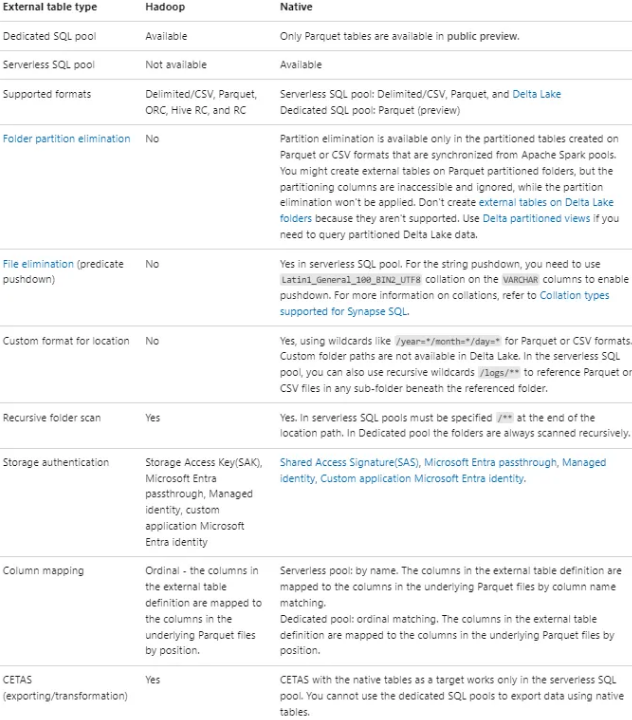
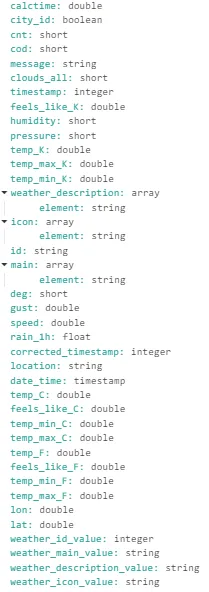
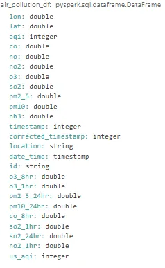
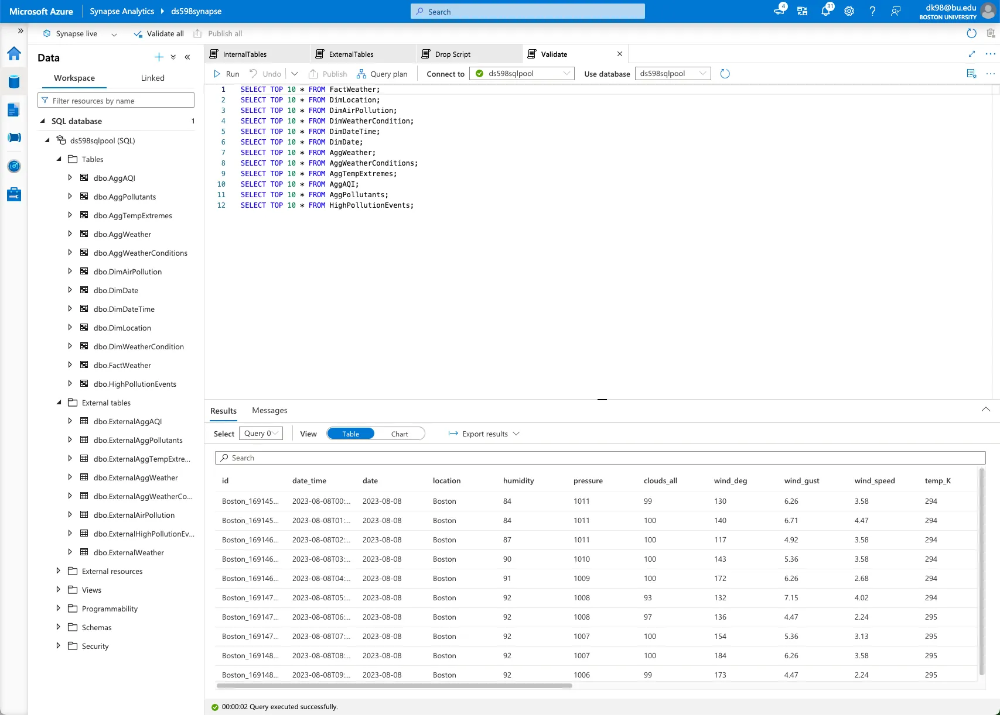
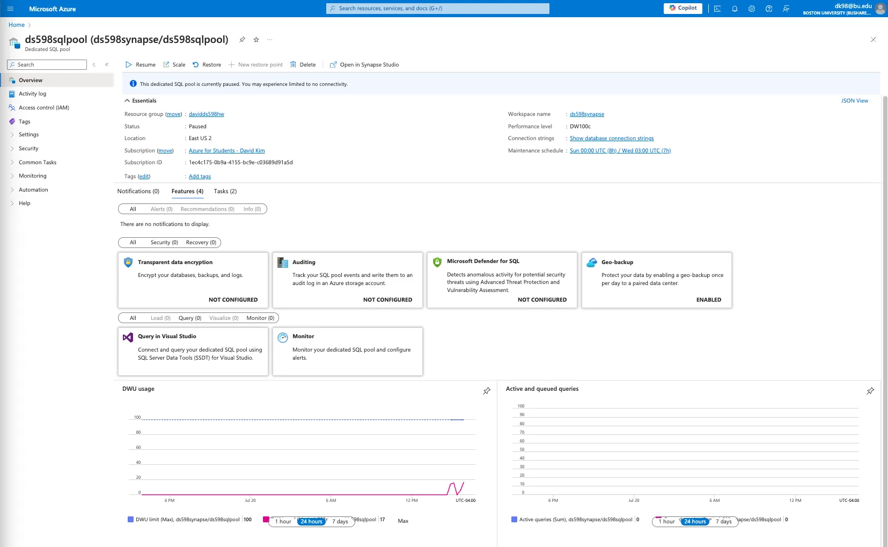

# HW7: Data Loading

**Objective:** Move the processed data from the Gold layer in Azure Data Lake Storage (ADLS) to the data warehouse using Azure Synapse Analytics. Specifically, we are ingesting data from our storage account first into *external tables*, then branching off those external tables to create internal synapse dimension, fact, and aggregated tables.

**IMPORTANT NOTE BEFORE YOU START:** The following provided schemas might not reflect what you have in your current datasets. Any code we provide you will most likely have to be modified/altered to match what you have in terms of data fields/data types.

>💡 ***What is Azure Synapse Analytics?*
[Azure Synapse Analytics](https://azure.microsoft.com/en-us/products/synapse-analytics#:~:text=Azure%20Synapse%20Analytics%20is%20an,log%20and%20time%20series%20analytics)**: query data using either dedicated or provisioned resources, providing a unified experience to ingest, prepare, manage, and serve data for immediate business intelligence and machine learning needs. Synapse enables efficient data processing across various data types, including structured, unstructured, and streaming data, making it ideal for complex analytical workloads.


https://learn.microsoft.com/en-us/answers/questions/1345798/azure-synapse-what-is-the-difference-between-nativ 
<details> <summary><strong>External Vs Internal Tables in Synapse (toggle the dropdown)</strong></summary> <br>
    In Azure Synapse Analytics, external and internal tables serve different purposes and are designed for different use cases. Here’s a detailed comparison of the two:
    ---
### 🗂️ Internal Tables

**Definition:**  
Internal tables (also known as user tables) are tables that reside within the Synapse SQL pool. Data is stored and managed directly within the Synapse service.

**Characteristics:**

1. **Storage Location:**  
   - Stored within the **Synapse SQL** pool’s distributed storage.

2. **Data Management:**  
   - Managed by Synapse, including distribution, replication, and backup.  
   - Supports indexes, constraints, transactions.

3. **Performance:**  
   - Optimized for high-performance querying.  
   - Ideal for fast, interactive queries on large datasets.

4. **Security:**  
   - Protected by Synapse security model (encryption, access control).

5. **Usage:**  
   - Best for data warehousing, ETL, and reporting where data is internal to Synapse.

**Examples of Internal Table Types:**

- Heap Tables  
- Clustered Index Tables  
- Clustered Columnstore Tables  

---
### 🌐 External Tables

**Definition:**  
External tables query data stored outside Synapse (e.g., in Azure Data Lake or Blob Storage), using [PolyBase](https://learn.microsoft.com/en-us/sql/relational-databases/polybase/polybase-guide?view=sql-server-ver16).

**Characteristics:**

1. **Storage Location:**  
   - Data stays in **ADLS**, Blob Storage, etc.

2. **Data Management:**  
   - Managed externally (Synapse doesn't control lifecycle).  
   - Supports unstructured/semi-structured data.

3. **Performance:**  
   - Dependent on external system performance and network latency.  
   - Can use `PolyBase` or `OPENROWSET`.

4. **Security:**  
   - Controlled by both Synapse and external storage access policies.

5. **Usage:**  
   - Best for big data, raw file access, and lakehouse scenarios.

**Examples of External Sources:**

- Azure Data Lake Storage (ADLS)  
- Azure Blob Storage  
- Other cloud data sources  

---
### 🔑 Key Differences

| Feature                | Internal Tables                          | External Tables                          |
|------------------------|------------------------------------------|------------------------------------------|
| **Storage**            | In Synapse SQL pool                      | In external storage (e.g., ADLS)         |
| **Managed By**         | Synapse                                  | External system                          |
| **Performance**        | High performance inside Synapse          | Depends on storage + network             |
| **Use Cases**          | Data warehousing, ETL, reporting         | Big data, lake analytics, virtual access |

---

</details>

>💡**Dedicated Vs. Serverless SQL Pools in Synapse**
We will be using the **dedicated SQL pool** in Synapse for the duration of this homework. Here are some primary differences:

- **Resource Management:** Dedicated pools require manual scaling and management, while serverless pools handle scaling automatically.
- **Billing:** Dedicated pools incur costs based on provisioned resources, whereas serverless pools charge based on the volume of data processed by each query.
- **Data Storage:** Dedicated pools store data within the pool itself, whereas serverless pools query data directly from external storage like Azure Data Lake.

Dedicated SQL pools also use **Hadoop External Tables** as opposed to **Native External Tables.** For our purposes, this means the **ORDERING OF OUR COLUMNS MATTER** in our external tables, and has to positionally match with the schemas we ingested upon. Native External Tables have the ability to match on column name irregardless of positioning, but since we are using dedicated for lower overall cost, positioning is something we ahve to keep in mind.


### Steps:
>⚠️ [We are providing you with this guidance to prevent any unnecessary costs!](https://learn.microsoft.com/en-us/answers/questions/992615/cost-comparison-serverless-vs-dedicated-sql-pool)
## 1. Set Up Azure Synapse Analytics
1. **Reuse existing Synapse Workspace**:
    - https://learn.microsoft.com/en-us/azure/synapse-analytics/quickstart-create-workspace
2. **Create a Dedicated SQL Pool**:
    ⚠️ [We are providing you with this guidance to prevent any unnecessary costs!](https://learn.microsoft.com/en-us/answers/questions/992615/cost-comparison-serverless-vs-dedicated-sql-pool)
    - In your Synapse workspace, go to “SQL pools” under the “Analytics pools” section.
    - Click on “New” to create a new SQL pool.
    - **Choose the cheapest tier (DW100c) for cost efficiency.**
    - Configure the SQL pool settings (name, performance level, etc.) and create the pool.
    - Note: To manage costs, make sure to pause the SQL pool when not in use.
   
    >⚠️ ****EXTREMELY IMPORTANT NOTE!!!**** 
    **THE SQL POOL COSTS *$1.30 PER HOUR*
    MAKE SURE YOU PAUSE IT WHEN YOU’RE NOT USING IT!!
    ** POINTS WILL BE DEDUCTED FROM YOUR HW GRADES IF YOU CANNOT PROPERLY MANAGE COST.**

>⚠️ ****EXTREMELY IMPORTANT NOTE!!!**** **SQL POOLS ARE COSTLY! PLEASE ENSURE ITS SHUT DOWN IF NOT BEING USED!!!

## 2. Load Data from ADLS to Data Warehouse
1. **Create External Tables**:

    >💡**External tables** in Azure Synapse Analytics are used to access and manage data stored outside the dedicated SQL pool. Here are some key uses:
        - Querying external data using Transact-SQL statements
        - Import data from external storage into dedicated SQL pool
            - different tools for quick ad-hoc analytics on data without needing to load it into the SQL pool 
    For the task below, we are first creating the external tables to load data initially without needing to store it in the SQL pool.
    
    >💡 An **external file format** in Azure Synapse Analytics defines the structure and format of data stored in external sources, such as Azure Blob Storage or Azure Data Lake Storage. This format is crucial for interpreting the data correctly when creating and querying external tables. 
    
    https://learn.microsoft.com/en-us/azure/synapse-analytics/sql/create-use-external-tables
    - In Synapse Studio, open a new SQL script
    - Connect to your dedicated SQL Pool (e.g. “ds598sqlpool”)
    - Use your created database (e.g. “ds598sqlpool”)
    - Create **external tables** to read data from the gold layer in ADLS.

    >💡**About NVARCHAR…**
    As you can see below, some of the column datatypes are casted to NVARCHAR(100). What this does is provide an all-encompassing datatype that acts similarly to the Python String datatype, where you can input numbers, strings, characters. etc.
    The downsides of using nvarchar are as follows:
            - **the increased query times**: nvarchar has significantly more overhead compared to int or float
            - **increased downstream workload:** if we cast all our datatypes to nvarchar, now our analysts querying this data have to manually cast each datatype within their **PowerBI** environment. PowerBI does provide robust autocasting features, this step should be generally avoided by casting the correct datatype within the external tables to begin with.
        While it is bad practice, NVARCHAR does allow us the flexibility to ingest different data formats within our synapse table. Generally, you should use the actual datatypes in the external and created tables and save yourself from datatyping issues within powerBI and AzureML. However, it is a decent troubleshooting method you can apply.
    
    </aside>
    
    **Overview of External Tables**
    You will be making several external table schemas. You can verify their creation after running the scripts by refreshing the "External Table" folder within synapse (3 dots --> refresh).
    - **ExternalAirPollution**:
        - Stores air pollution data, including pollutants like CO, NO, NO2, etc.
    - **ExternalWeather**:
        - Contains weather data, such as temperature, humidity, and wind speed.
    - **ExternalAggWeather**:
        - Provides aggregated weather statistics, such as average temperature and humidity.
    - **ExternalAggWeatherConditions**:
        - Stores counts of different weather conditions by date.
    - **ExternalAggTempExtremes**:
        - Records the maximum and minimum temperatures by date.
    - **ExternalAggAQI**:
        - Contains average Air Quality Index (AQI) values by date.
    - **ExternalAggPollutants**:
        - Stores average concentrations of various pollutants.
    - **ExternalHighPollutionEvents**:
        - Tracks the number of high pollution events by date.
    
    #### **Connect to External Data Source and Parquet File Format**
    Connect to the container holding your homework files! We will specify the file path within the external table code.
    ```sql
    -- Create external data source to connect to your container
    CREATE EXTERNAL DATA SOURCE MyDataSource 
    WITH (
        LOCATION = 'https://your_storage_account_name.dfs.core.windows.net/your_container'
    );
    GO
    
    -- Create external file format
    CREATE EXTERNAL FILE FORMAT ParquetFileFormat
    WITH (
        FORMAT_TYPE = PARQUET
    );
    GO
    ```
    
    ####**External Weather Table —> FactWeather Table**
    
    >💡Since Dedicated SQL Pool’s external tables are based on positioning, your external table might look drastically different based on what you did for prior homeworks. The following code follows the below schemas we used in our provided code examples (take note of the column ordering).
    
    ```sql
    CREATE EXTERNAL TABLE ExternalWeather ( --positionality matters for dedicated tables! Ensure its the correct order of datatypes and correct number
        calctime FLOAT,
        city_id BIT,
        cnt SMALLINT,
        cod SMALLINT,
        message NVARCHAR(100),
        clouds_all SMALLINT,
        timestamp INT,
        feels_like_K FLOAT,
        humidity SMALLINT,
        pressure SMALLINT,
        temp_K FLOAT,
        temp_max_K FLOAT,
        temp_min_K FLOAT,
        weather_description NVARCHAR(100),  -- Assuming NVARCHAR for array type if data is stored as strings
        icon NVARCHAR(100),                 -- Assuming NVARCHAR for array type if data is stored as strings
        id NVARCHAR(100),
        main NVARCHAR(100),                 -- Assuming NVARCHAR for array type if data is stored as strings
        deg SMALLINT,
        gust FLOAT,
        speed FLOAT,
        rain_1h REAL,
        corrected_timestamp INT,
        location NVARCHAR(100),
        date_time DATETIME,
        temp_C FLOAT,
        feels_like_C FLOAT,
        temp_min_C FLOAT,
        temp_max_C FLOAT,
        temp_F FLOAT,
        feels_like_F FLOAT,
        temp_min_F FLOAT,
        temp_max_F FLOAT,
        lon FLOAT,
        lat FLOAT,
        weather_id_value INT,
        weather_main_value NVARCHAR(100),
        weather_description_value NVARCHAR(100),
        weather_icon_value NVARCHAR(100)
    )
    WITH (
        LOCATION = '...processed_weather.parquet', --may be different based on your storage location
        DATA_SOURCE = MyDataSource,
        FILE_FORMAT = ParquetFileFormat
    );
    GO
    ```
    

    >💡Now we are going to use SQL scripts to actually load the data into our external tables within our SQL pool! 
    We first create the table within our SQL pool corresponding to each external table, then load the data from external → internal table. We need to create a **dedicated SQL Pool** to create dedicated SQL tables. The reasoning for this is because external tables don't actually hold the data. 
    https://learn.microsoft.com/en-us/azure/synapse-analytics/sql-data-warehouse/sql-data-warehouse-develop-ctas
    
    </aside>
    
    ```sql
    -- Create FactWeather table with matching data types (internal sql table)
    CREATE TABLE FactWeather (
        id NVARCHAR(100),                             -- String identifier to match ExternalWeather's NVARCHAR(100)
        date_time DATETIME2,                          -- Higher precision datetime to match ExternalWeather's DATETIME2 usage
        date DATE,        
        location NVARCHAR(100),                       -- Shorter NVARCHAR(100) to match ExternalWeather's location column
        humidity SMALLINT,                            -- Small integer to match ExternalWeather's SMALLINT for humidity
        pressure SMALLINT,                            -- Small integer to match ExternalWeather's SMALLINT for pressure
        clouds_all SMALLINT,                          -- Small integer to match ExternalWeather's SMALLINT for clouds_all
        wind_deg SMALLINT,                            -- Small integer to match ExternalWeather's SMALLINT for wind_deg
        wind_gust FLOAT,                              -- Float for wind gust data, matching ExternalWeather's FLOAT
        wind_speed FLOAT,                             -- Float for wind speed, matching ExternalWeather's FLOAT
        temp_K FLOAT,                                 -- Float to match ExternalWeather's temp_K
        feels_like_K FLOAT,                           -- Float to match ExternalWeather's feels_like_K
        temp_max_K FLOAT,                             -- Float to match ExternalWeather's temp_max_K
        temp_min_K FLOAT,                             -- Float to match ExternalWeather's temp_min_K
        temp_C FLOAT,                                 -- Float to match ExternalWeather's temp_C
        feels_like_C FLOAT,                           -- Float to match ExternalWeather's feels_like_C
        temp_max_C FLOAT,                             -- Float to match ExternalWeather's temp_max_C
        temp_min_C FLOAT,                             -- Float to match ExternalWeather's temp_min_C
        temp_F FLOAT,                                 -- Float to match ExternalWeather's temp_F
        feels_like_F FLOAT,                           -- Float to match ExternalWeather's feels_like_F
        temp_max_F FLOAT,                             -- Float to match ExternalWeather's temp_max_F
        temp_min_F FLOAT,                             -- Float to match ExternalWeather's temp_min_F
        weather_combined_value NVARCHAR(200)          -- NVARCHAR to match ExternalWeather, increased length for combined data
    );
    GO
    ```
    
    ```sql
    -- Insert data into FactWeather
    --wind columns might be null if you didnt ingest them, so remove them from the insert
    INSERT INTO FactWeather (id, date_time, date, location, humidity, pressure, clouds_all, temp_K, feels_like_K, temp_max_K, temp_min_K, temp_C, feels_like_C, temp_max_C, temp_min_C, temp_F, feels_like_F, temp_max_F, temp_min_F, weather_combined_value)
    SELECT 
        id,
        date_time, 
        CAST(date_time AS DATE) AS date,
        location,
        humidity, 
        pressure, 
        clouds_all, 
        temp_K, 
        feels_like_K, 
        temp_max_K, 
        temp_min_K,
        temp_C,
        feels_like_C,
        temp_max_C,
        temp_min_C,
        temp_F,
        feels_like_F,
        temp_max_F,
        temp_min_F,
        CONCAT(weather_id_value, '_', weather_icon_value) AS weather_combined_value
    FROM 
        ExternalWeather;
    GO
    ```
    

    >💡 **Key things** happening here:
        - matching column names with the ones created from synapse
        - casting column datatypes to NVARCHAR(100) if originally string
        - bringing data from external → internal table for later downstream usage
        - debug with:
            ```sql
            SELECT *
            FROM [dbo].[FactWeather]
            ```
    
            
    ```sql
    --in case you mess up and need to restart...run this code (can't revise tables after creation, easier to just drop it and remake):
    DROP EXTERNAL TABLE EXTERNALWEATHER
    GO
    
    DROP  TABLE FactWeather
    GO
    ```

    
    **External AirPollution Table —> DimAirPollution Table**
    
    ```sql
    CREATE EXTERNAL TABLE ExternalAirPollution (
        lon FLOAT,                          -- Longitude
        lat FLOAT,                          -- Latitude
        aqi INT,                            -- Air Quality Index (integer)
        co FLOAT,                           -- Carbon monoxide level
        no FLOAT,                           -- Nitric oxide level
        no2 FLOAT,                          -- Nitrogen dioxide level
        o3 FLOAT,                           -- Ozone level
        so2 FLOAT,                          -- Sulfur dioxide level
        pm2_5 FLOAT,                        -- Particulate matter 2.5 level
        pm10 FLOAT,                         -- Particulate matter 10 level
        nh3 FLOAT,                          -- Ammonia level
        timestamp INT,                      -- Original timestamp (integer)
        corrected_timestamp INT,            -- Corrected timestamp (integer)
        location NVARCHAR(100),             -- Location as a string
        date_time DATETIME2,                -- Date and time with timestamp precision
        id NVARCHAR(100),                   -- String identifier
        o3_8hr FLOAT,                       -- Ozone level (8-hour average)
        o3_1hr FLOAT,                       -- Ozone level (1-hour average)
        pm2_5_24hr FLOAT,                   -- PM2.5 level (24-hour average)
        co_8hr FLOAT,                       -- CO level (8-hour average)
        pm10_24hr FLOAT,                    -- PM10 level (24-hour average)
        so2_1hr FLOAT,                      -- SO2 level (1-hour average)
        so2_24hr FLOAT,                     -- SO2 level (24-hour average)
        no2_1hr FLOAT,                      -- NO2 level (1-hour average)
        us_aqi INT                          -- U.S. Air Quality Index (integer)
    )
    WITH (
        LOCATION = 'gold/processed_air_pollution/processed_air_pollution.parquet',
        DATA_SOURCE = MyDataSource,
        FILE_FORMAT = ParquetFileFormat
    );
    GO
    ```
    
    ```dart
    -- Create and load DimAirPollution table
    CREATE TABLE DimAirPollution (
        id NVARCHAR(100),
        aqi NVARCHAR(100),
        co FLOAT,
        no FLOAT,
        no2 FLOAT,
        o3 FLOAT,
        so2 FLOAT,
        pm2_5 FLOAT,
        pm10 FLOAT,
        nh3 FLOAT
    );
    GO
    ```
    
    ```sql
    INSERT INTO DimAirPollution (id, aqi, co, no, no2, o3, so2, pm2_5, pm10, nh3)
    SELECT DISTINCT 
        id, 
        aqi, 
        co, 
        no, 
        no2, 
        o3, 
        so2, 
        pm2_5, 
        pm10, 
        nh3
    FROM 
        ExternalAirPollution;
    ```
    
    ```sql
    --in case yo screw up and need to restart...
    DROP EXTERNAL TABLE ExternalAirPollution
    GO
    
    DROP  TABLE DimAirPollution 
    GO
    ```
    
    **Other External Tables**
    
    Follow the same process - referring to the schema found in your synapse notebook output and translating that into external tables —> inserting into regular tables. We recommend doing this process one by one and doing a SELECT to make sure each table is in fact being created in the intended way.
    
    >💡**Datatyping General Rule of Thumb:** here are some datatype conversions you can consider doing when going from  synapse schemas → external tables
        - string → nvarchar(100)
        - double → float
        - timestamp → datetime2
    
    ```sql
    CREATE EXTERNAL TABLE ExternalAggWeatherConditions (
    		date DATE,
        weather_main_value VARCHAR(100),
        count INT)
      WITH (
    	  LOCATION = --location of your external agg weather conditions file,
    	  DATA_SOURCE = ?,
    	  FILE_FORMAT = ?
    );
    GO
    ```
    
    ```sql
    CREATE EXTERNAL TABLE ExternalAggTempExtremes (
    	...
    )
    WITH (
        LOCATION = --location of your external agg temp extremes file,
        DATA_SOURCE = ?,
        FILE_FORMAT = ?
    );
    GO
    ```
    
    ```sql
    CREATE EXTERNAL TABLE ExternalAggAQI (
    		...
    );
    GO
    ```
    
    ```sql
    CREATE EXTERNAL TABLE ExternalHighPollutionEvents (
      ...
    );
    GO
    ```
    
<details>
  <summary><strong>📊 Fact vs Dimension vs Aggregated Tables</strong></summary>

<div markdown="1">

### **Fact Tables**
- **Purpose**: Fact tables store quantitative data, known as "measures" or "facts," related to business events or transactions. They capture the core transactional or event-driven data, such as sales amounts, quantities, temperatures, and air quality indices, often at a granular level.
- **Characteristics**:
  - Contain **numeric values**, which can be aggregated or summarized (e.g., **SUM**, **AVG**).
  - Have **foreign keys** that reference dimension tables, linking each fact to descriptive context.
  - Often have a **high number of rows** but fewer columns than dimension tables.

---

### **Dimension Tables**
- **Purpose**: Dimension tables store descriptive attributes, or "dimensions," that provide context to the facts. They help categorize and provide details to make facts understandable, allowing users to filter, group, and organize fact data for analysis.
- **Characteristics**:
  - Contain **textual information** (e.g., city names, dates, product categories).
  - Have a **primary key** that links to fact tables via foreign keys.
  - Usually have a **lower number of rows** than fact tables but more descriptive columns.

---

### **Aggregated Tables**
- **Purpose**: Aggregation tables are specialized fact tables that store **pre-computed, summarized data** to improve query performance.
- **Characteristics**:
  - Contain **summarized data**, like daily, monthly, or yearly totals or averages.
  - Help reduce computational load and improve query response time.
  - May include aggregations at different levels (e.g., **daily**, **monthly**, **by location**).

</div>
</details>

        
*All the below tables are derived from our created internal tables **ExternalWeather** and **ExternalAirPollution**.*
    
If any of the column names **DO NOT WORK**, refer back to your original synapse schemas **OR** refer back to the structure of the externalweather and externalairpollution tables.

```sql
-- Create and load DimDateTime table
CREATE TABLE DimDateTime (
-- A dimension table that breaks down date and time components.
-- Contains detailed temporal information such as year, month, day, hour, minute, and whether the date is a weekend.
    date_time DATETIME,
    date DATE,
    year INT,
    month INT,
    day INT,
    hour INT,
    minute INT,
    second INT,
    quarter INT,
    week INT,
    day_of_week INT,
    day_name VARCHAR(10),
    month_name VARCHAR(10),
    is_weekend BIT
);
GO

INSERT INTO DimDateTime (date_time, date, year, month, day, hour, minute, second, quarter, week, day_of_week, day_name, month_name, is_weekend)
SELECT DISTINCT 
    date_time,
    CAST(date_time AS DATE) AS date,
    DATEPART(YEAR, date_time) AS year,
    ... AS month,
    ... AS day,
    ... AS hour,
    ... AS minute,
        ... AS second,
    ... AS quarter,
    ... AS week,
    ... AS day_of_week,
    ... AS day_name,
    ... AS month_name,
    CASE WHEN DATEPART(WEEKDAY, date_time) IN (1, 7) THEN 1 ELSE 0 END AS is_weekend
FROM 
    ExternalWeather;
GO
```

```sql
-- Create and load DimWeatherCondition table
CREATE TABLE DimWeatherCondition (
-- A dimension table for weather condition details.
-- Stores information about different weather conditions, including main weather categories and descriptions, along with a combined weather condition value.
    weather_id_value VARCHAR(100),
    weather_icon_value VARCHAR(10),
    weather_main_value VARCHAR(100),
    weather_description_value VARCHAR(100),
    weather_combined_value VARCHAR(110)
);
GO

INSERT INTO DimWeatherCondition
SELECT DISTINCT 
    weather_id_value, 
    weather_icon_value, 
    weather_main_value, 
    weather_description_value,
    CONCAT(weather_id_value, '_', weather_icon_value) AS weather_combined_value
FROM 
    ...--what is your external table for weather?
GO
```

```sql
-- Create and load DimDate table
CREATE TABLE DimDate (
-- A dimension table focused on date attributes.
-- Provides date details like year, month, day, quarter, and week, along with names for days and months, and a weekend indicator.
);
GO

-- Populate DimDate Table from ExternalWeather
INSERT INTO DimDate ()
SELECT DISTINCT 
FROM
GO
```

```sql
-- Create and load AggTempExtremes table
CREATE TABLE AggTempExtremes (
-- An aggregated table that records temperature extremes.
-- Stores maximum and minimum temperatures for each date.
...
);
GO

INSERT INTO AggTempExtremes (...)
SELECT ... 
FROM ...
GO
```

```sql
-- Create and load AggWeatherConditions table
CREATE TABLE AggWeatherConditions (
-- An aggregated table that counts occurrences of weather conditions.
-- Provides the number of instances of each weather condition by date.
...
);
GO

INSERT INTO AggWeatherConditions (...)
SELECT ...
FROM ...
GO
```

```sql
-- Create and load AggWeather table
CREATE TABLE AggWeather (
-- An aggregated table that summarizes weather data.
-- Includes average temperature, humidity, and wind speed, as well as maximum and minimum temperatures for each date.
);
GO

INSERT INTO AggWeather (...)
SELECT ...
FROM ...
GO
```

```sql
-- Create and load HighPollutionEvents table
CREATE TABLE HighPollutionEvents (
-- A table tracking high pollution events.
-- Contains the count of high pollution occurrences for each date.
-- REFER TO THE SCHEMA IN synapse
);
GO

INSERT INTO HighPollutionEvents (...)
SELECT ...
FROM ...
GO
```

```sql
-- Create and load AggPollutants table
CREATE TABLE AggPollutants (
-- An aggregated table for air pollutant data.
-- Stores average concentrations of various pollutants (CO, NO2, O3, etc.) by date.
...
);
GO

INSERT INTO AggPollutants (...)
SELECT ...
FROM ...
GO
```

```sql
-- Create and load AggAQI table
CREATE TABLE AggAQI (
-- An aggregated table for Air Quality Index (AQI) data.
-- Contains average AQI values for each date.
);
...
GO

INSERT INTO AggAQI (...)
SELECT ...
FROM ...
GO
```
<details>
  <summary><strong>⚠️ DROP SCRIPT (Use with caution!)</strong></summary>

<div markdown="1">

> **Only drop tables in case you encounter issues with specific ones!**  
> Running the entire script **will reset all your progress**.

```sql
-- Drop external tables
DROP EXTERNAL TABLE ExternalAggAQI;
DROP EXTERNAL TABLE ExternalAggPollutants;
DROP EXTERNAL TABLE ExternalAggTempExtremes;
DROP EXTERNAL TABLE ExternalAggWeather;
DROP EXTERNAL TABLE ExternalAggWeatherConditions;
DROP EXTERNAL TABLE ExternalAirPollution;
DROP EXTERNAL TABLE ExternalHighPollutionEvents;
DROP EXTERNAL TABLE ExternalWeather;
GO

-- Drop regular tables
DROP TABLE AggAQI;
DROP TABLE AggPollutants;
DROP TABLE AggTempExtremes;
DROP TABLE AggWeather;
DROP TABLE AggWeatherConditions;
DROP TABLE DimDateTime;
DROP TABLE DimLocation;
DROP TABLE DimAirPollution;
DROP TABLE DimWeatherCondition;
DROP TABLE FactWeather;
DROP TABLE HighPollutionEvents;
DROP TABLE DimDate;
GO
```
    
```sql
-- Drop external tables
DROP EXTERNAL TABLE ExternalAggAQI;
DROP EXTERNAL TABLE ExternalAggPollutants;
DROP EXTERNAL TABLE ExternalAggTempExtremes;
DROP EXTERNAL TABLE ExternalAggWeather;
DROP EXTERNAL TABLE ExternalAggWeatherConditions;
DROP EXTERNAL TABLE ExternalAirPollution;
DROP EXTERNAL TABLE ExternalHighPollutionEvents;
DROP EXTERNAL TABLE ExternalWeather;
GO

-- Drop regular tables
DROP TABLE AggAQI;
DROP TABLE AggPollutants;
DROP TABLE AggTempExtremes;
DROP TABLE AggWeather;
DROP TABLE AggWeatherConditions;
DROP TABLE DimDateTime;
DROP TABLE DimLocation;
DROP TABLE DimAirPollution;
DROP TABLE DimWeatherCondition;
DROP TABLE FactWeather;
DROP TABLE HighPollutionEvents;
DROP TABLE DimDate;
GO
```
</div>
</details>

### 3. Validate Data in Synapse Analytics
1. **Query the Data**:
```sql
SELECT TOP 10 * FROM FactWeather;
SELECT TOP 10 * FROM DimLocation;
SELECT TOP 10 * FROM DimAirPollution;
SELECT TOP 10 * FROM DimWeatherCondition;
SELECT TOP 10 * FROM DimDateTime;
SELECT TOP 10 * FROM DimDate;
SELECT TOP 10 * FROM AggWeather;
SELECT TOP 10 * FROM AggWeatherConditions;
SELECT TOP 10 * FROM AggTempExtremes;
SELECT TOP 10 * FROM AggAQI;
SELECT TOP 10 * FROM AggPollutants;
SELECT TOP 10 * FROM HighPollutionEvents;
```
1. **Pause the SQL Pool**:
    - Go to the [Azure Portal](https://portal.azure.com/).
    - Navigate to your Synapse Analytics workspace.
    - Click on "SQL pools" under the "Data" section.
    - Select your Dedicated SQL pool.
    - Click on "Pause" to pause the SQL pool when not in use to save costs.

### Deliverables
1. **Screenshot of Data in Synapse Analytics**:
    - Provide a screenshot showing the loaded data in the internal tables in Azure Synapse Analytics (show the dropdown of all the tables you created, and a successful selection from the various tables).
        
        
        
        
