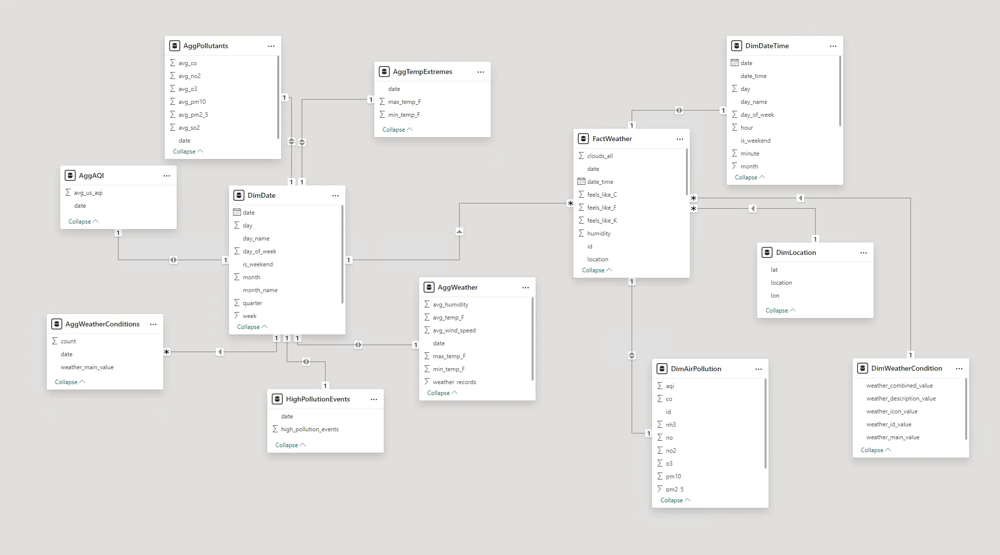
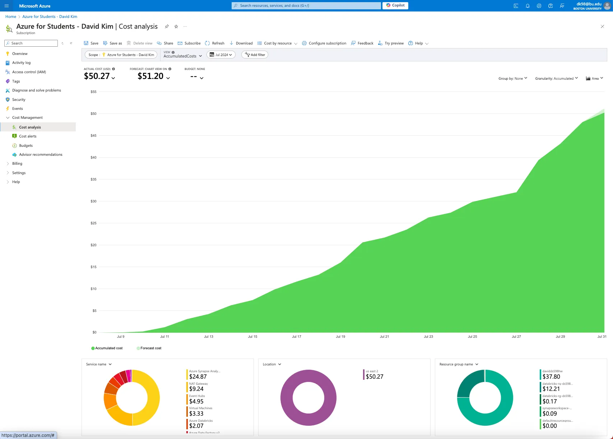

# HW8: Data Visualization

**Objective:** Create interactive visualizations to analyze the processed data using Power BI connected to Azure Synapse Analytics. This involves setting up the connection between Power BI and Synapse, creating dashboards, and generating insights from the visualized **historical** data.

**IMPORTANT NOTE BEFORE YOU START:** The following provided schemas might not reflect what you have in your current datasets. Any code we provide you will most likely have to be modified/altered to match what you have in terms of data fields/data types. Also, positionality of columns should be accounted for when **inserting into the Dedicated SQL Table**.

>💡**You can choose to either connect to the Azure Synapse or the Blob Storage here (Gold Layer)**
>    - **Azure Blob Storage**:
        - Performance depends on file sizes, formats, and query complexity.
        - Best suited for **lightweight data** or when working with files like CSV or Parquet directly.
>    - **Azure Synapse**:
        - Optimized for querying large datasets using Synapse's distributed compute power.
        - Faster for aggregations, joins, and complex queries.

>**You can also choose to either use Tableau or PowerBI.** We provide instruction on data connections to PowerBI here, but feel free to look through this documentation to better understand Tableau and Azure Storage connections: 
    - [Synapse to Tableau](https://help.tableau.com/current/pro/desktop/en-us/examples_azure_sql_dw.htm)
    - [Stream Analytics/Databricks to Tableau](https://www.tableau.com/blog/streaming-analytics-tableau-and-databricks) (the coolest thing you can do with Tableau IMO)
    - **THERE IS NO NATIVE CONNECTOR BETWEEN TABLEAU AND BLOB STORAGE.** Possible workarounds include downloading the tables locally and uploading them to Tableau directly (ugly method but we don’t have too much data for our use-case).

### 1. Set Up Power BI Desktop (Only for Windows)
1. **Download and Install Power BI Desktop**:
    - Visit the [Power BI website](https://powerbi.microsoft.com/) and download Power BI Desktop.
    - Install Power BI Desktop on your computer.
2. **Sign In to Power BI**:
    - Open Power BI Desktop and sign in with your Microsoft account.

### 2. **Access Power BI via Azure Virtual Desktop (for Mac Users specifically...)**
1. **Connect to Azure Virtual Desktop**:
    - Mac users should access Power BI by connecting to Azure Virtual Desktop using the Remote Desktop Client.
    - Download ‘[Microsoft Remote Desktop](https://apps.apple.com/us/app/microsoft-remote-desktop/id1295203466?mt=12)’ from the Apple Store.
    - Login to your Microsoft Azure account.
    - Refer to this tutorial: [Connect to Azure Virtual Desktop with Remote Desktop Client](https://learn.microsoft.com/en-us/azure/virtual-desktop/users/connect-macos)
2. **Configure Folder Redirection for Local Folder Access**:
    - Configure folder redirection to access local folders on your VM.
    - Refer to this tutorial: [Configure Folder Redirection](https://bowdoin.teamdynamix.com/TDClient/1814/Portal/KB/ArticleDet?ID=132977)
3. **Access PowerBI Desktop**
    - Within Microsoft Remote Desktop, access the ‘PowerBI Desktop.’

### 3. Connect Power BI to Azure Synapse Analytics/Blob Storage
>💡Below we show you the process in connecting Power BI Synapse Analytics. If you want to save on compute, Blob Storage would be the go-to alternative. Here is a brief 3 minute video showing you how to connect via **Blob Storage:** https://youtu.be/_VO3pmKIwzQ 

1. **Turn On the Serverless/Dedicated SQL Pool**:
    - In the Azure Portal, navigate to your Synapse workspace from Homework 6.
    - Go to the "SQL pools" section and start your dedicated SQL pool.

2. **Get Connection Details from Synapse**:
- Note down the server name and database name of your SQL pool.

3. **Connect Power BI to Synapse**:
- In Power BI Desktop, click on "Home" -> "Get Data" -> "Azure" -> "Azure Synapse Analytics SQL."
- Enter the server name and database name. (e.g. *ds598synapse.sql.azuresynapse.net*)
- Select ‘Import.’
- Choose the **authentication method** and sign in with your Azure credentials.
- Select the tables or views containing the transformed data and load them into Power BI.
    - Select only the internal tables. External tables may cause some issues.
>⚠️ **SAVE YOUR POWERBI FILE TO YOUR REDIRECTED FOLDER**

4. **Turn Off the Dedicated/Serverless SQL Pool** 
    - After loading the data into Power BI, go back to the Azure Portal and stop your dedicated SQL pool to save costs.
        >⚠️ **VERY IMPORTANT TO TURN OFF THE SQL POOL!! COSTS $1.30 PER HOUR!!!**

### 4. Create Data Models and Relationships
1. **Model the Data**:
    - In Power BI, go to the "Model" view.
    - Define relationships, and create the appropriate data model.
        
        
    - Create calculated columns and measures as needed for your analysis. (Optional)
        - This is to show that you can aggregate data in PowerBI instead of during Batch Processing **but we should already have the aggregate tables within Synapse.**
            
            ```sql
            -- Not specific for our data. These are just general examples
            
            -- Example DAX measure for average temperature
            AvgTemperature = AVERAGE(transformed_data[avg_temp])
            
            -- Example DAX measure for average AQI
            AvgAQI = AVERAGE(transformed_data[avg_aqi])
            
            ```
    <aside>
💡

>**Optional Connection: Automated ML → PowerBI** 
Feel free to revisit this snippet after you have an automated ML workflow running. We can directly reference a model’s outputs from an automated ML workflow within our PowerBI dashboard environment. Here is a YT tutorial showing an in-depth walk through in how to create visualizations off of the predicted output of your Automated ML:
https://youtu.be/0sAuOt-wO4s?t=552 

### 5. Create Interactive Dashboards
https://www.youtube.com/watch?v=NISsW-bVAwU (cool video, saves you a bunch of time)
1. **Create Visualizations**:
    >💡 Interactive = responsive to user input in this case.
    This can just be simple filters, or you could implement deeper interactiveness if you have the capability to do so. All we are expecting are **clean dashboards** that helps us answer the question: **How are *Air pollution levels affected by weather?*** (*this is the most straight forward question to answer with the data, but feel free to branch out)*
    Compare trends, aggregate visualizations, etc. 
- In the "Report" view, use various visualizations (charts, tables, maps) to create interactive dashboards.
- Drag and drop fields onto the canvas to create visualizations like bar charts, line charts, scatterplots, and more.
2. **Filter and Slice Data**:
    - Add slicers and filters to allow users to interact with the data and drill down into specific insights.
3. **Customize the Report**:
- Format the visualizations, and add titles, labels, and descriptions to make the report user-friendly and informative.

***Specific Visualization Deliverables**:*
- *Create at least three different types of charts (e.g., bar chart, line chart, scatterplot).*
- *Include a slicer to filter data by date.*
- *Create a visualization showing the relationship between temperature and AQI.*
- *Create a table summarizing key metrics (e.g., average temperature, average AQI)*.

### 6. Take Screenshots of your Historical Data Dashboard

### Deliverables:

1. **Screenshots of the Dashboard:** Screenshots showing your dashboard.
2. **Screenshots of Synapse Pool, FunctionApp, Stream Analytics:** Screenshots showing the paused/stopped dedicated SQL pool, function app, and stream analytics.
3. **Screenshot of Cost Management**: A screenshot showing the cost management details across the entire semester.


