# HW9: Predictive Analysis (OPTIONAL)

**Objective**: Build machine learning models using Azure AutoML to **predict air pollution levels based on weather data**. This involves setting up an Azure Machine Learning workspace, preparing data for model training by combining datasets from ADLS, training, and deploying ML models (starting with regression, but feel free to utilize others based on use-case and model evaluations). Optional objective of using real-time data to create real-time predictive scoring.

**Tools**: Azure Machine Learning, Azure AutoML, Azure Data Lake Storage (ADLS)

>💡 **Azure ML Common Troubleshooting Tips** 
> https://learn.microsoft.com/en-us/answers/questions/1855156/completely-stuck-in-azure-ml-for-creating-compute

### 1. Set Up Azure Machine Learning 
1. **Create an Azure Machine Learning Workspace**
- create name for application insights
- credential based access
- Leave data encryption blank

1. **Set Up Role for Storage Account Access**
    
    >💡 Azure ML often needs to interact with data stored in Azure Blob Storage for tasks like training models, running experiments, and validating results. The ‘***Storage Blob Data Contributor***’ role ensures Azure ML Workspace has the necessary permissions to interact with Azure Blob Storage for training, deployment, and operationalizing machine learning models, while maintaining the principle of least privilege
    >Give the ‘**Storage Blob Data Contributor**’ role to your Azure Machine Learning Workspace.
2. **Set Up Compute Instances**:
    >💡**Instances vs Clusters**
    A **compute cluster** is a scalable **set** of virtual machines used for running training or inference jobs. 
        - For high-compute, large-scale training jobs.
        - When the workload varies, and you need the cluster to automatically scale.
        - For parallel or distributed training tasks.
        **A compute instance** is a single virtual machine primarily used for development and experimentation.
        - For development, testing, and debugging in an interactive environment.
        - For lightweight or one-off model training tasks.
        - To explore and analyze data directly in the workspace
    >*We will be using compute instance for the duration of this project.*
    Types of clusters: https://www.youtube.com/watch?v=dJbutCMjmqs&list=PLMXQvYI7QV6fyPuxaM7Uw0VvNXm2yThNZ&ab_channel=RADACAD  
- Select ‘Standard_DS11_v2’ for the VM Size.
    >💡**`Standard_DS11_v2`** is an excellent choice for cost-effective, balanced compute power, especially for medium-sized machine learning workloads that don’t require GPUs. It’s an ideal starting point for experimentation and development in Azure Machine Learning.
- Set ‘Auto shut down’ to **30 Minutes of inactivity**. (you can choose to go lower)
    
    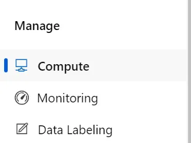
    
    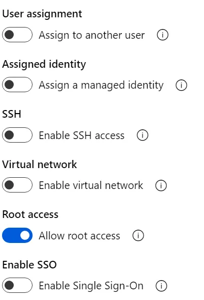
    
    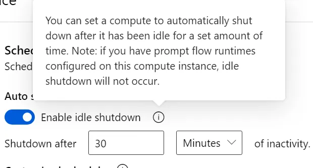

### 2. Prepare Data for Model Training (Historical Model)
1. **Create a New Notebook in Azure ML Studio**
2. **Load and Combine Data from ADLS**
    
    <aside>
    💡
    
    **Synapse vs Gold Layer Ingestion**
    
    We are relegating the Synapse tables for only PowerBI (HW10) and not this HW to save on unneccessary compute usage.
    
    Ideally, we would turn on our Synapse service and ingest the tabular data into our AzureML workflow. However, given our budget constraints and the minimal scale of our data / simple querying processes,  you can choose to run your AzureML workflows directly on the gold layer. Here is the **optional code** for the AzureML connections with Synapse, which I encourage you to explore in case you want to mirror it within your projects! Provided code is just to get you started. You can choose to land the model outputs directly into synapse as well, but this will require some permissions setup for Azure ML → Synapse and batch insert queries that you would probably much rather land in the gold layer instead…
    
    ```python
    import pandas as pd
    import pyodbc
    
    # Synapse connection details, straightfoward enough since we only require read permissions for synapse
    server = "<your-synapse-server>.database.windows.net"
    database = "<your-database-name>"
    username = "<your-username>"
    password = "<your-password>"
    driver = "{ODBC Driver 17 for SQL Server}"
    
    # Define SQL queries for relevant tables
    fact_weather_query = """
    SELECT
        id,
        date_time,
        date,
        location,
        humidity,
        pressure,
        clouds_all,
        wind_deg,
        wind_gust,
        wind_speed,
        temp_C,
        temp_F,
        weather_combined_value
    FROM FactWeather
    """
    
    dim_air_pollution_query = """
    SELECT
        id,
        aqi,
        co,
        no2,
        o3,
        so2,
        pm2_5,
        pm10
    FROM DimAirPollution
    """
    
    dim_location_query = """
    SELECT
        location,
        lon,
        lat
    FROM DimLocation
    """
    
    agg_aqi_query = """
    SELECT
        date,
        avg_us_aqi
    FROM AggAQI
    """
    
    # Function to fetch data from Synapse tables
    def read_from_synapse(query):
    #Port 1433 is the default port used by Microsoft SQL Server and Azure SQL Database
        connection_string = f"DRIVER={driver};SERVER={server};PORT=1433;DATABASE={database};UID={username};PWD={password}"
        with pyodbc.connect(connection_string) as conn:
            data = pd.read_sql(query, conn)
        return data
        
    # Load data from Synapse tables
    fact_weather_data = read_from_synapse(fact_weather_query)
    dim_air_pollution_data = read_from_synapse(dim_air_pollution_query)
    dim_location_data = read_from_synapse(dim_location_query)
    agg_aqi_data = read_from_synapse(agg_aqi_query)
    
    # Combine relevant data for Azure ML pipeline
    # Join FactWeather with DimAirPollution on 'id' for weather and pollution data
    combined_data = pd.merge(fact_weather_data, dim_air_pollution_data, on="id", how="inner")
    
    # Optionally join with DimLocation to include geographical data
    combined_data = pd.merge(combined_data, dim_location_data, on="location", how="left")
    
    # Optionally join with aggregated AQI data
    **combined_data** = pd.merge(combined_data, agg_aqi_data, on="date", how="left")
    
    # Display the resulting combined dataset
    print(**combined_data**.head())
    
    # Save combined data to a local file (optional)
    **combined_data**.to_csv('combined_synapse_data.csv', index=False)
    
    ```
    
    </aside>
    
    Use the following code to load and combine the data from the **gold layer** of ADLS into the notebook:
    
    ```python
    import pandas as pd
    import io
    from azure.storage.filedatalake import DataLakeServiceClient
    
    # Configure ADLS connection details, might need to change the file paths to match your file directories
    account_name = "your_adls_account_name"
    account_key = "your_account_key" #access key provided within storage acc.
    file_system_name = "hwdata"
    pollution_file_path = "gold/processed_air_pollution/processed_air_pollution.parquet"
    weather_file_path = "gold/processed_weather/processed_weather.parquet"
    
    # Authenticate to ADLS using account key
    service_client = DataLakeServiceClient(account_url=f"https://{account_name}.dfs.core.windows.net", credential=account_key)
    
    # Function to read parquet file from ADLS
    def read_parquet_from_adls(file_path):
        file_system_client = service_client.get_file_system_client(file_system=file_system_name)
        file_client = file_system_client.get_file_client(file_path)
        download = file_client.download_file()
        downloaded_bytes = download.readall()
        return pd.read_parquet(io.BytesIO(downloaded_bytes))
    
    # Load data
    pollution_data = read_parquet_from_adls(pollution_file_path)
    weather_data = read_parquet_from_adls(weather_file_path)
    
    # Combine data on the 'id' column
    combined_data = pd.merge(pollution_data, weather_data, on='id')
    
    # Display the combined data
    combined_data.head()
    
    ```
    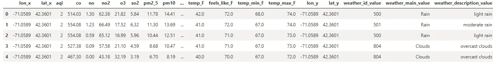
    3. **Select Features for Model Training**:
    - Inspect the columns of the combined dataset and select relevant features for training the model.
    
    ```python
    # Display column names to choose features
    print(combined_data.columns)
    
    # Select weather-related features for model training (can choose to exclude wind_deg, wind_gust, and wind_speed
    weather_features = [
        'temp_K', 'temp_max_K', 'temp_min_K',
        'feels_like_K', 'humidity', 'pressure',
        'wind_deg', 'wind_gust', 'wind_speed',
        'clouds_all'
    ]
    
    # Include the target variable 'aqi'
    selected_features = combined_data[weather_features + ['aqi']]
    
    ```
4. **Save and Upload the Data to ADLS**
    - Upload the `ml_data.csv` file to the Azure Data Lake Storage
    
    
    >💡 **Chunking** is a robust strategy for handling large datasets in distributed systems like ADLS, ensuring efficiency, reliability, and scalability during uploads. It minimizes memory usage, handles network interruptions gracefully, and optimizes the upload process for better performance. Here is a breakdown of the below code: 
        - `service_client`: The Azure Data Lake Service Client is used to interact with ADLS.
        - `file_system_client`: Accesses the specific file system (container) in ADLS.
        - `file_client`: Handles operations (e.g., create, append, flush) on the file within the file system.
        - The CSV data is split into smaller chunks (`chunk_size`), and each chunk is uploaded sequentially using `file_client.append_data()`. This ensures that large files are uploaded incrementally.
        - `offset` keeps track of the current file position for appending each chunk correctly.
        - After all chunks are uploaded, `file_client.flush_data(offset)` finalizes the upload and makes the file available for access.
      
    Code below should create a folder in the gold layer called ML
    
    ```python
    # Function to write CSV file to ADLS in chunks
    def write_csv_to_adls_in_chunks(dataframe, file_path, chunk_size=1024*1024):
        file_system_client = service_client.get_file_system_client(file_system=file_system_name)
        file_client = file_system_client.get_file_client(file_path)
    
        # Convert dataframe to CSV in memory
        output = io.StringIO()
        dataframe.to_csv(output, index=False)
        data = output.getvalue().encode()
    
        # Upload CSV data in chunks
        file_client.create_file()
        offset = 0
        for i in range(0, len(data), chunk_size):
            chunk_data = data[i:i + chunk_size]
            file_client.append_data(data=chunk_data, offset=offset, length=len(chunk_data))
            offset += len(chunk_data)
        file_client.flush_data(offset)
    
    # Write the selected features to a CSV file in ADLS
    output_file_path = "gold/ml/ml_data.csv"
    write_csv_to_adls_in_chunks(selected_features, output_file_path)
    
    print(f"CSV file saved to ADLS at: {output_file_path}")
    ```
5. **Save and Upload MLTable File to ADLS**
    - Azure Machine Learning has its own data asset format.
        - You must follow this to use your data for AutoML
            
            [Create Data Assets - Azure Machine Learning](https://learn.microsoft.com/en-us/azure/machine-learning/how-to-create-data-assets?view=azureml-api-2&tabs=cli#create-a-data-asset-table-type)
            
    - Upload the `MLTable` file to the Azure Data Lake Storage.
        
        
        >💡This code creates and uploads an **MLTable** file to Azure Data Lake Storage (ADLS). The **MLTable** file describes the structure and format of a dataset to be used with **Azure Machine Learning (Azure ML)**. It enables Azure ML services to understand how to read and interpret the associated data file (`ml_data.csv`).
        https://go.microsoft.com/fwlink/?linkid=2208056  
            - Facilitates reproducibility and portability of datasets.
            - Reduces the likelihood of errors when integrating data with machine learning workflows.
        
        ```python
        # Create an MLTable file to describe the dataset structure and save it in the same directory as your data file.
        # Create an MLTable file to describe the dataset structure and save it in the same directory as your data file.
        
        mltable_content = """
        paths:
          - file: ./ml_data.csv
        transformations:
          - read_delimited:
              delimiter: ','
        """
        
        mltable_file_path = "gold/ml/MLTable"
        file_client = service_client.get_file_system_client(file_system_name).get_file_client(mltable_file_path)
        file_client.create_file()
        file_client.append_data(data=mltable_content.encode(), offset=0, length=len(mltable_content))
        file_client.flush_data(len(mltable_content))
        
        print(f"MLTable file saved to ADLS at: {mltable_file_path}")
        
        ```
### 3. Train and Deploy Machine Learning Models Using AutoML
  >💡**Automated ML**
    https://youtu.be/Gx3feP-3TS0?list=PLMXQvYI7QV6fyPuxaM7Uw0VvNXm2yThNZ 
    ****The AzureML section of Azure Machine Learning provides a comprehensive suite of tools and services for every stage of the machine learning lifecycle. 
    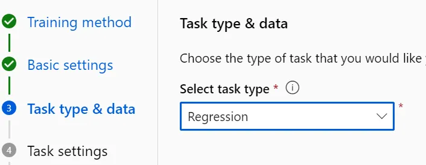
    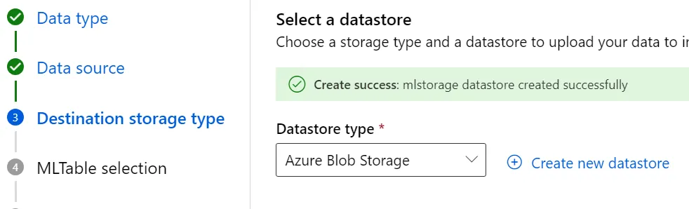
    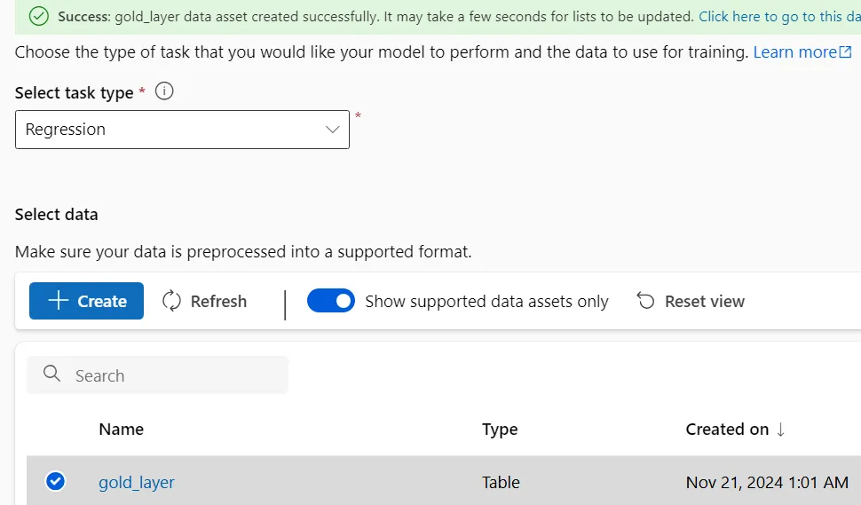

1. **Create and Run an AutoML Experiment**:
    1. Run a **regression task to predict ‘aqi’ based on the weather features**.
    2. Make sure your train-test split is 70/30 or 80/20
    3. The experiment will take approximately **7 hours (compute instance is slow)**
        >💡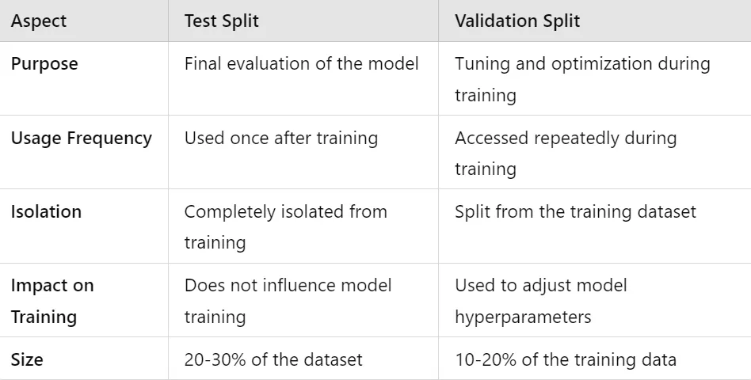
  - Make sure to use compute instance as your compute type prior to running
    
    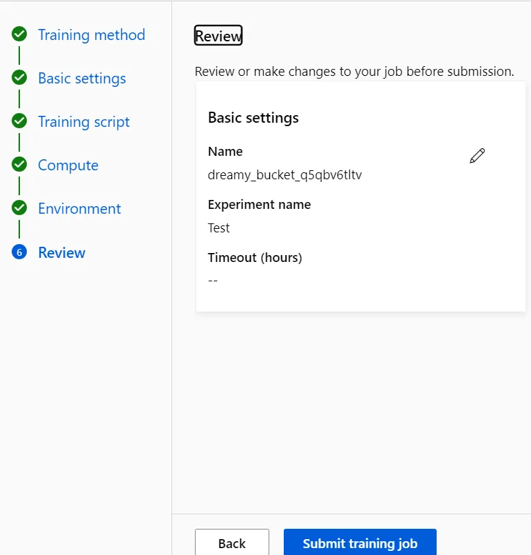
### 4. Verify Predictions and Model Performance
1. **Validate Predictions**:
    - Once the AutoML run is complete, select the best model.
    - Compare the predicted AQI values with actual AQI values from the dataset to evaluate model performance.

### 5. Stop Azure AI Compute Instance
1. **Stop the Compute Instance**:
    - In the Azure ML Studio, go to "Compute" and stop the compute instance to avoid unnecessary charges.

### 6. Stream Analytics x AzureML
>💡Now we want to ingest stream data directly into **AzureML.** This enables us to ingest real-time data into our model and make predictions on the fly. This 
- **Deploy a [Machine Learning Model](https://learn.microsoft.com/en-us/azure/stream-analytics/machine-learning-udf?utm_source=chatgpt.com):** Use Azure Machine Learning to train and deploy your model as a web service. Ensure the web service accepts and returns JSON-serialized data and has an associated Swagger definition to define the input and output schemas.
- **Configure Stream Analytics Job:**
    - **Input Configuration:** Set up inputs from sources like Azure Event Hubs, IoT Hubs, or Blob Storage to ingest streaming data.
    - **Function Addition:** Add an Azure Machine Learning function to your Stream Analytics job by specifying the Machine Learning workspace, endpoint, and function signature.
    - **Query Definition:** Write a Stream Analytics query that invokes the Machine Learning function, processes the data, and directs the output to the desired sink, such as Power BI for visualization or Azure SQL Database for storage.
        [Microsoft Learn](https://learn.microsoft.com/en-us/azure/stream-analytics/machine-learning-udf?utm_source=chatgpt.com)

### Quick aside: ADLS Landing (Batch-oriented, storage-first workflows) vs. Direct API Endpoint (Real-time, action-oriented workflows)

Here is a quick comparison between ADLS landing vs Direct API endpoint for "real-time" inference AKA predicting against the stream. We will be using Direct API endpoint for our usecase.

| **Aspect** | **Land in ADLS** | **Direct API Endpoint** |
| --- | --- | --- |
| **Purpose** | Store data for batch processing, future analysis, or training. | Real-time inference and immediate actionable insights. |
| **Data Flow** | Stream Analytics processes and lands data in ADLS for downstream consumption. | Stream Analytics processes and sends data directly to an API for immediate use. |
| **Latency** | Higher latency (minutes to hours, depending on downstream workflows). | Low latency (milliseconds to seconds for inference). |
| **Use Case** | Suitable for batch workflows, historical analysis, and model training. | Ideal for real-time predictions and event-driven actions. |
| **Storage Cost** | Requires storage costs for data landed in ADLS. | No storage cost; only API usage charges. |
| **Processing Complexity** | Subsequent workflows (e.g., training, inference) require additional tools or pipelines (e.g., Data Factory). | Direct integration with no need for intermediate processing. |
| **Scalability** | Can handle large-scale data storage and batch processing. | Scales well for real-time but limited by API throughput. |
| **Resilience and Replayability** | Data is persisted and can be reprocessed if needed. | Data is not persisted; failure at the API level may lead to loss. |
| **Examples** | - Store raw telemetry data for long-term analytics.- Prepare datasets for ML training.- Process offline trends. | - Fraud detection in financial transactions.- Predictive maintenance in IoT systems.- Personalized recommendations in real-time. |


>💡**Direct Real-Time Inference: No Synapse Involved**
    >- **What Happens:**
        - Real-time data flows from sources (e.g., IoT devices, Event Hub) to **Azure ML Online Endpoints** or **Azure Function Apps** for inference.
        - Predictions are made immediately and returned to the calling system (e.g., Azure Stream Analytics).
    >- **Why Synapse is Not Used:**
        - Synapse focuses on data preparation, aggregation, and large-scale processing, which introduce latency not suited for real-time predictions.
        - Azure ML Online Endpoints are optimized for low-latency, on-demand inference.

### **Direct API Endpoint Approach**  (API trustworthy enough for real-time inference)
You **can bypass Azure Stream Analytics** and send data directly from **Event Hubs** to **Azure ML Online Endpoints**, but this depends on your use case. Azure Stream Analytics (ASA) adds value when you need **data transformation**, **aggregation**, or **enrichment** before sending it for inference. If your data is already in the right format and requires no preprocessing, you can directly integrate **Event Hubs** with Azure ML. This would involve scripting either within Azure Functions or Databricks with the proper authentication.

| **Scenario** | **Use Stream Analytics** | **Direct Event Hubs to Azure ML** |
| --- | --- | --- |
| **Data needs transformation or aggregation** | Yes (e.g., tumbling windows, filtering) | No |
| **Data format matches ML endpoint** | No | Yes |
| **Enrichment with static data** | Yes | No |
| **Low-latency requirement** | Moderate latency (adds seconds) | Lowest latency (direct connection) |
| **Multiple outputs needed** | Yes (e.g., dashboards, storage, ML endpoint) | No |
| **Simplified architecture** | No | Yes |
>💡**Configure HTTP Output in Stream Analytics for AzureML connection**
>- Set up the endpoint URL (e.g., `https://<ml-endpoint>.azureml.net/score`).
>- Provide authentication credentials (API key or Managed Identity).
1. Setup **Azure Stream Analytics** Job alongside Event Hub (refer back to homework 4)
2. Configure Stream Analytics output 
    1. Add **HTTP** as an output
    2. Provide the following details:
        - **Endpoint URL:** [Scoring URI of the deployed Azure ML Online Endpoint](https://learn.microsoft.com/en-us/azure/machine-learning/how-to-deploy-online-endpoints?view=azureml-api-2&tabs=cli)
        - **Authentication:** Use API Key from the Azure ML Endpoint
        - **Request Format:** JSON
3. Write SQL query to prepare the stream data in the right format (in real-time) within Stream Analytics
    
    ```sql
    *(example query)*
    SELECT 
        deviceId, 
        AVG(temperature) AS avg_temp,
        MAX(pressure) AS max_pressure,
        System.Timestamp AS event_time
    INTO [BlobStorageOutput]
    FROM [EventHubInput]
    GROUP BY TumblingWindow(minute, 1), deviceId #a time-based grouping mechanism in data analysis where data points are aggregated into one-minute intervals
    ```
4. Stream Analytics supports HTTP output to send data to any REST API (including Azure ML endpoints)
5. Add HTTP Output:
    - Go to your Stream Analytics job in the Azure Portal
    - Navigate to **Outputs** → **Add** → **REST API**
    - Provide the following details:
        - **Endpoint URL:** The scoring URI of your deployed Azure ML model (e.g., `https://<region>.api.azureml.ms/v1.0/endpoint`)
        - **Authentication:**
            - Use the **API key** from Azure ML for authentication
        - **Method:** `POST`
        - **Payload:** Define the format of the data to be sent in the request body (e.g., JSON)
    
    >💡Train and deploy a machine learning model to an Azure ML Online Endpoint.
    >- The endpoint will handle real-time inference for incoming data.
    >- We can display these predictions into a **Real-Time Dashboard!**
    ```python
    from azureml.core import Workspace, Model
    from azureml.core.webservice import AksWebservice, Webservice
    from azureml.core.model import InferenceConfig
    
    # Workspace and Model
    workspace = Workspace.from_config()
    model = Model(workspace, name="predictive_model")
    
    # Inference Config
    inference_config = InferenceConfig(entry_script="score.py", environment=myenv)
    
    # Deploy Model
    deployment_config = AksWebservice.deploy_configuration(cpu_cores=1, memory_gb=2)
    service = Model.deploy(workspace, "real-time-endpoint", [model], inference_config, deployment_config)
    service.wait_for_deployment()
    print(f"Scoring URI: {service.scoring_uri}")
    ```

### Deliverables (no submission needed, just verify if you are done):
- **Screenshot of Completed Job**
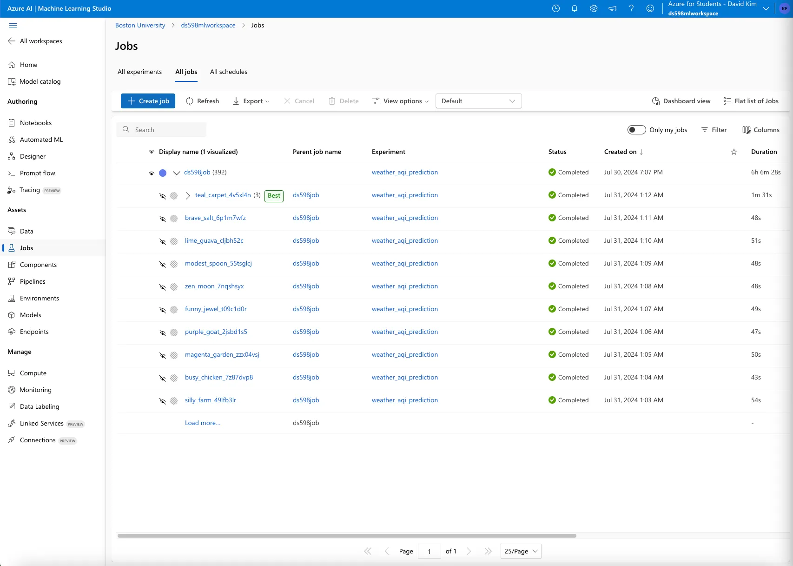
- **Screenshot of Best ML Model with Metrics**
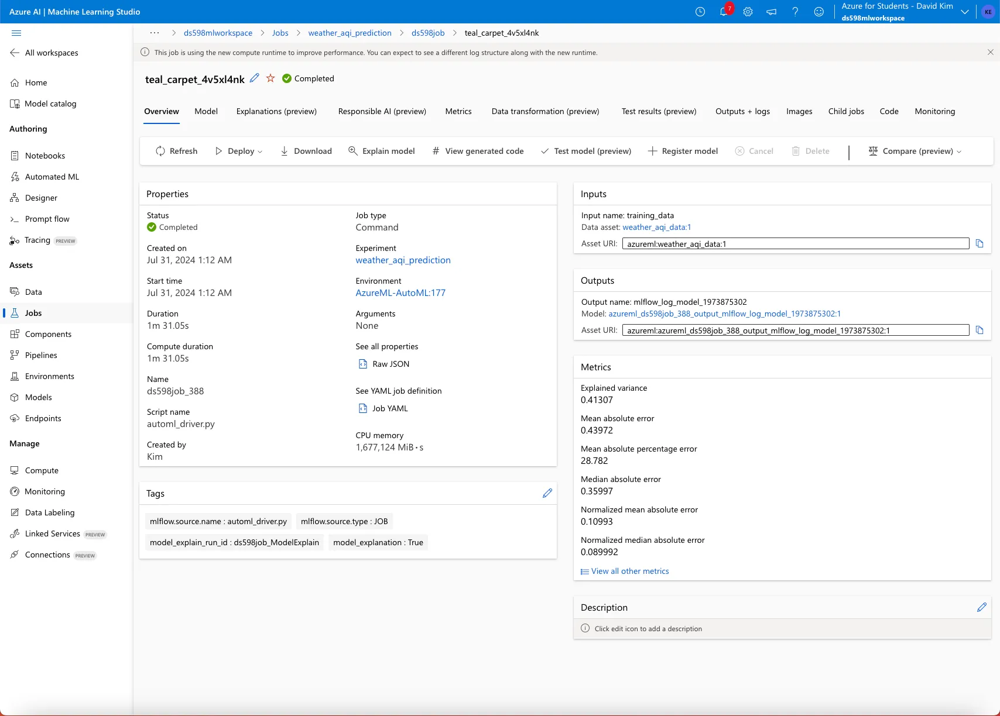
- **Screenshot of Stopped Compute Instance**
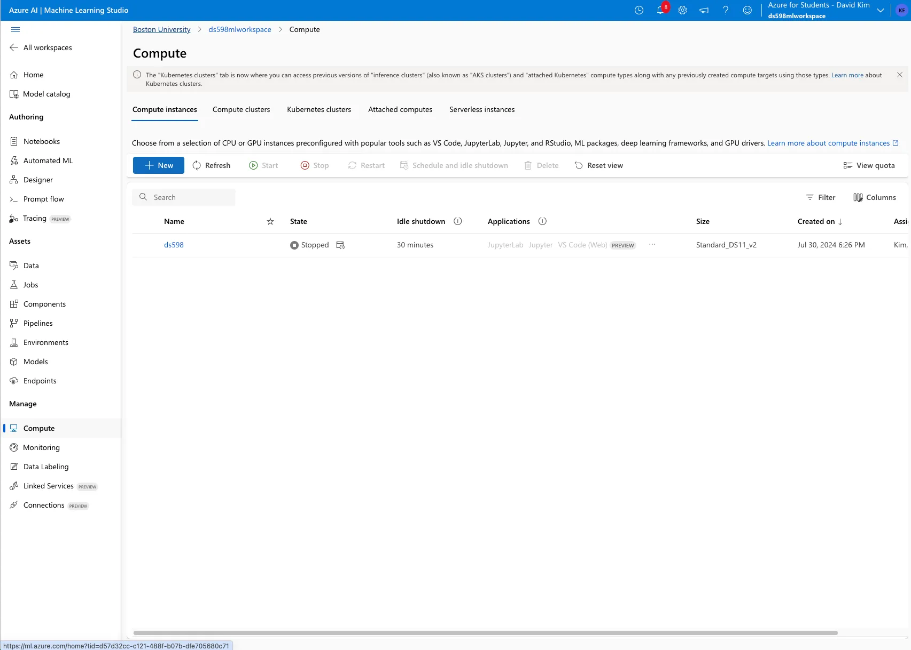

>💡***A Letter to the Students:***
Thank you for toughing it out with us throughout the semester! I can’t express how appreciative of you guys. As this is a new course, we are constantly trying to improve and refine the assignments, lectures, discussions, and project to make it as useful/valuable as it can be for your cloud-environment endeavors. I can’t thank everyone enough for their constant feedback, patience, and understanding as we continue to develop this class. My greatest hope is that this course was able to meaningfully contribute to your future career journeys. Whether its walking through your end-to-end modern data solution (final project) in an interview, or the cloud services troubleshooting in your future workflows, I hope we provided some valuable experience to reflect on and learn from.
>Until we meet again Data Warriors!
Josh 
*(we will probably meet again for the final review)*
